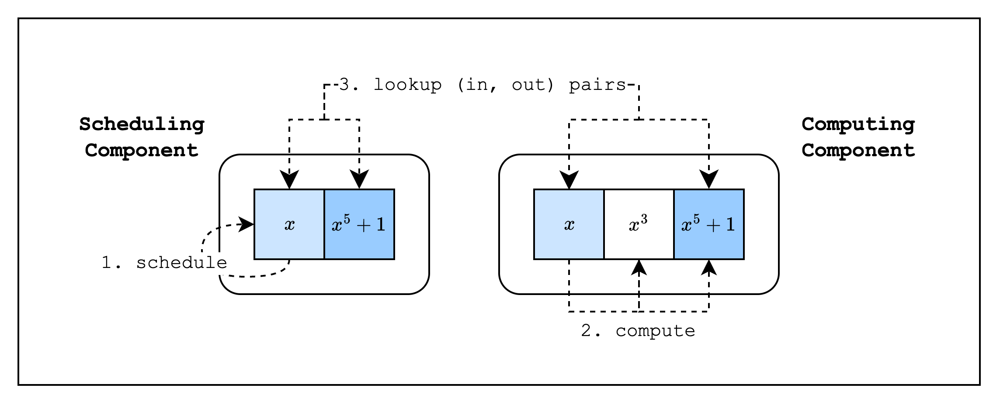
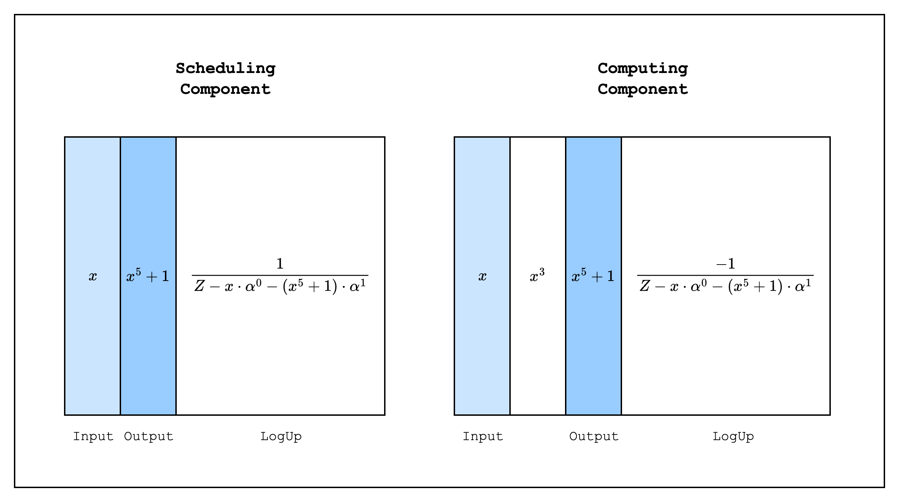

# Components

So now that we know how to create a self-contained AIR, the inevitable question arises: How do we make this modular?

Fortunately, Stwo provides an abstraction called a **component** that allows us to create independent AIRs and compose them together. In other proving frontends, this is also commonly referred to as a _chip_, but the idea is the same.

One of the most common use cases of components is to separate frequently used functions (e.g. a hash function) from the main component into a separate component and reuse it, avoiding trace column bloat. Even if the function is not frequently used, it could be useful to separate it into a component to avoid the degree of the constraints becoming too high. This second point is possible because when we create a new component and connect it to the old component, we do it by using lookups, which means that the constraints of the new component are not added to the degree of the old component.

## Example

To illustrate how to use components, we will create two components where the main component calls a hash function component. For simplicity, instead of an actual hash function, the second component will compute \\(x^5 + 1\\) from an input \\(x\\). This component will have in total three columns: [input, intermediate, output], which will correspond to the values \\([x, x^3, x^5 + 1]\\). Our main component, on the other hand, will have two columns, [input, output], which corresponds to the values \\([x, x^5 + 1]\\).

We'll now refer to the main component as the **scheduling component** and the hash function component the **computing component**, as the main component is essentially _scheduling_ the hash function component to run its function with a given input and the hash function component _computes_ on the provided input. As can be seen in [Figure 1](#fig-component-example), the inputs and outputs of each component are connected by lookups.

<figure id="fig-component-example" style="text-align: center;">
    
    <figcaption><center><span style="font-size: 0.9em">Figure 1: Scheduling and Computing components</span></center></figcaption>
</figure>

### Design

<figure id="fig-component-trace" style="text-align: center;">
    
    <figcaption><center><span style="font-size: 0.9em">Figure 2: Traces of each component</span></center></figcaption>
</figure>

When we implement this in Stwo, the traces of each component will look like [Figure 2](#fig-component-trace) above. Each component has its own original and LogUp traces, and the inputs and outputs of each component are connected by lookups. Since the scheduling component adds the inputs as positive values and the outputs as negative values, while the computing component adds the inputs as negative values and the outputs as positive values, the verifier can simply check that the sum of the two LogUp columns is zero.

## Code

```rust,ignore
{{#include ../../../stwo-examples/examples/components.rs:main_start}}
{{#include ../../../stwo-examples/examples/components.rs:main_prove}}
{{#include ../../../stwo-examples/examples/components.rs:main_end}}
```

The code above for proving the components should look pretty familiar by now. Since we need to do everything twice the amount of times, we create structs like `ComponentsStatement0`, `ComponentsStatement1`, `Components` and `ComponentsProof`, but the main logic is the same.

Let's take a closer look at how the LogUp columns are generated.

```rust,ignore
{{#include ../../../stwo-examples/examples/components.rs:gen_scheduling_logup_trace_start}}
{{#include ../../../stwo-examples/examples/components.rs:gen_scheduling_logup_trace_row}}
{{#include ../../../stwo-examples/examples/components.rs:gen_scheduling_logup_trace_end}}

{{#include ../../../stwo-examples/examples/components.rs:gen_computing_logup_trace_start}}
{{#include ../../../stwo-examples/examples/components.rs:gen_computing_logup_trace_row}}
{{#include ../../../stwo-examples/examples/components.rs:gen_computing_logup_trace_end}}
```

As you can see, the LogUp values of the input and output columns of both the scheduling and computing components are batched together, but in the scheduling component, the output LogUp value is subtracted from the input LogUp value, while in the computing component, the input LogUp value is subtracted from the output LogUp value. This means that when the LogUp sums from both components are added together, they should cancel out and equal zero.

Next, let's check how the constraints are created.

```rust,ignore
{{#include ../../../stwo-examples/examples/components.rs:scheduling_eval_start}}
{{#include ../../../stwo-examples/examples/components.rs:scheduling_eval_evaluate}}

{{#include ../../../stwo-examples/examples/components.rs:computing_eval_start}}
{{#include ../../../stwo-examples/examples/components.rs:computing_eval_evaluate}}
```

As you can see, we define the LogUp constraints for each component, and we also add two constraints that make sure the computations \\(x^3\\) and \\(x^5 + 1\\) are correct.

```rust,ignore
{{#include ../../../stwo-examples/examples/components.rs:main_start}}
{{#include ../../../stwo-examples/examples/components.rs:main_verify}}
```

Finally, we verify the components!
