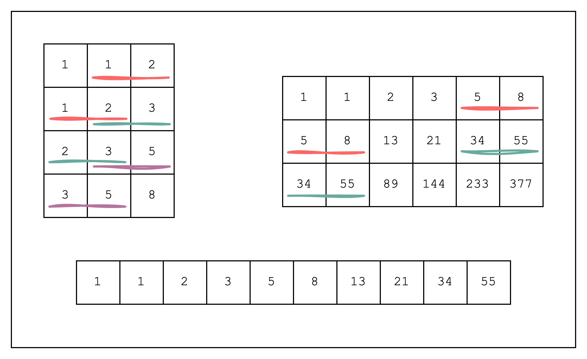
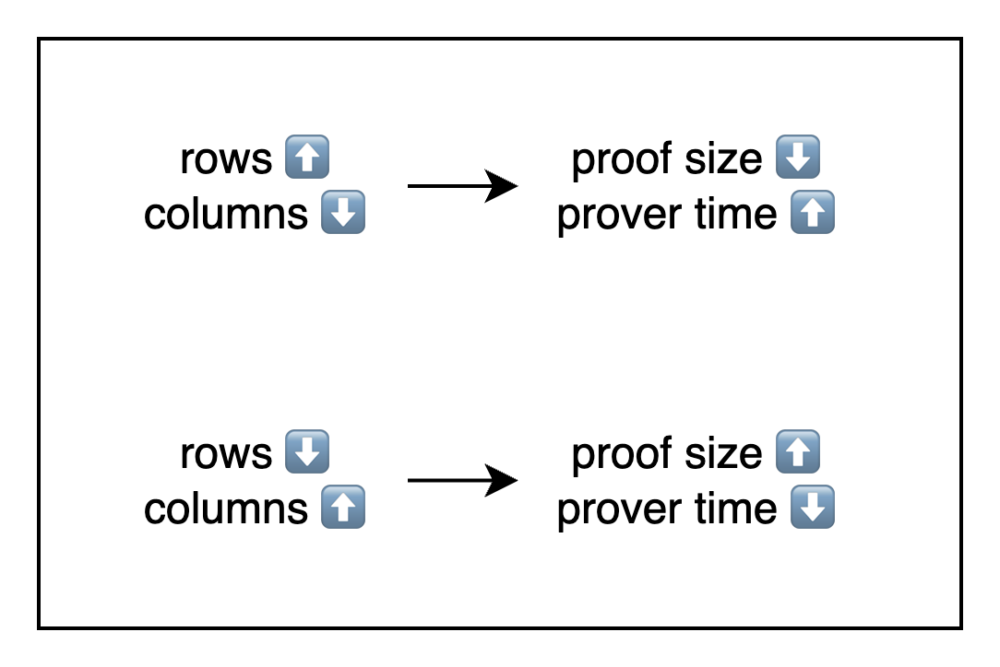

# Concepts

Stwo is a universal framework for proving and verifying Algebraic Intermediate Representations (AIRs). It provides a flexible framework that allows developers to:

- Create a table and define a set of constraints over it
- Efficiently connect different parts of the table using lookups
- Create chips (i.e. custom AIRs) for specific computational tasks and compose them together using lookups

In this section, we'll introduce the concepts of AIRs, lookups, and chips, and in the next section, we'll show how to use these concepts to create a custom AIR.

## AIRs

An AIR is simply a table where each cell is populated by an element from a finite field and where a set of predefined constraints (i.e. equations defined over multiple cells that equal to 0) are satisfied for every row.

The cells of each column of the table are considered to be evaluations of a polynomial over a domain of the finite field, and since the constraints are the same for every row, we can represent the constraints as equations over these polynomials.

There are multiple ways to represent the same computation as an AIR. For example, if we look at the figure below, we can see a Fibonacci sequence represented as three different AIRs. The top left AIR is perhaps the most intuitive, as it represents each Fibonacci step as a single row, but it is also inefficient as we need to duplicate most of the Fibonacci numbers in the table. The top right AIR is a bit more efficient in that we duplicate less values, while the bottom AIR is the most efficient as it does not duplicate any values.

<figure>
  
  <figcaption>
Figure 1: Multiple representations of the Fibonacci sequence
</figcaption>
</figure>

The main takeaway is that we can generally choose a representation that is most efficient for our use-case. As a general rule of thumb, using more rows and less columns will result in a smaller proof size and a slower prover time because we need to commit to less columns but need to perform more FFTs. On the other hand, using more columns and less rows will result in a larger proof size and a faster prover time because we need to commit to more columns but need to perform less FFTs.

<figure>
  
  <figcaption>
Figure 2: The trade-off between rows and columns
</figcaption>
</figure>

## Lookups

Lookups are simply a way to connect one part of the table to another. When we "look up" a value, we are doing nothing more than creating a constraint that allows us to use that value in another part of the table without breaking soundness.

Some use-cases of lookups include:

1. Prove equality: we want to prove that the values of the first column are equal to the values of the second column.
2. Prove permutation: we want to prove that the values of the first column are a permutation of the values of the second column.
3. Prove permutation with multiplicities: we want to prove that each value of the first column appears a certain number of times over multiple columns.

### LogUp

LogUp is a technique used to constrain lookups. It's a successor to Plookup, and is especially useful for proving permutation with multiplicities. Plookup and its variants use a technique called the Grand Product Check.

$$
\prod_{i=0}^{n-1} (X - a_i) = \prod_{i=0}^{n-1} (X - b_i)
$$

In the equation above, we can check that the set $\{a_0,...,a_{n-1}\}$ is a permutation of the set $\{b_0,...,b_{n-1}\}$ by setting $X$ to a random value provided by the verifier.

However, this becomes inefficient when we have multiplicities since we need to encode the multiplicities as powers of each lookup polynomial, and thus the degree of the polynomial increases linearly with the number of multiplicities.

$$
\prod_{i=0}^{n-1} (X - a_i) = \prod_{i=0}^{n-1} (X - b_i)^{m_i}
$$

On the other hand, LogUp uses the derivative of the Grand Product Check.

$$
\sum_{i=0}^{n-1} \frac{1}{X - a_i} = \sum_{i=0}^{n-1} \frac{m_i}{X - b_i}
$$

In this approach, each lookup polynomial is represented as a rational function with the multiplicity as the numerator. This transformation is significant because the degree of the polynomial remains constant regardless of the number of multiplicities, making LogUp more efficient for handling multiple lookups of the same value.

## Chips

Thanks to lookups, we now have a way to efficiently connect different columns of the table. We can combine this with AIRs to create chips.

A chip is a term for columns that serve a specialized purpose. For example, a Poseidon chip refers to columns that just compute the Poseidon hash function. In this chip, the input and output of the function will be placed at designated locations, which means that the different columns that want to use this chip can just "look up" the input and output from the Poseidon chip.

Let's say we have a VM AIR that can invoke the Poseidon hash function. Instead of computing the hash function directly inside the VM AIR, it can be more efficient to use a Poseidon chip. This is because we can isolate the high degree of constraints required to constrain the Poseidon hash function result, from the constraints of the VM AIR.

Now that we have learned the basic concepts used in Stwo, let's move on to the next section where we'll show how to use these concepts to create a custom AIR.
