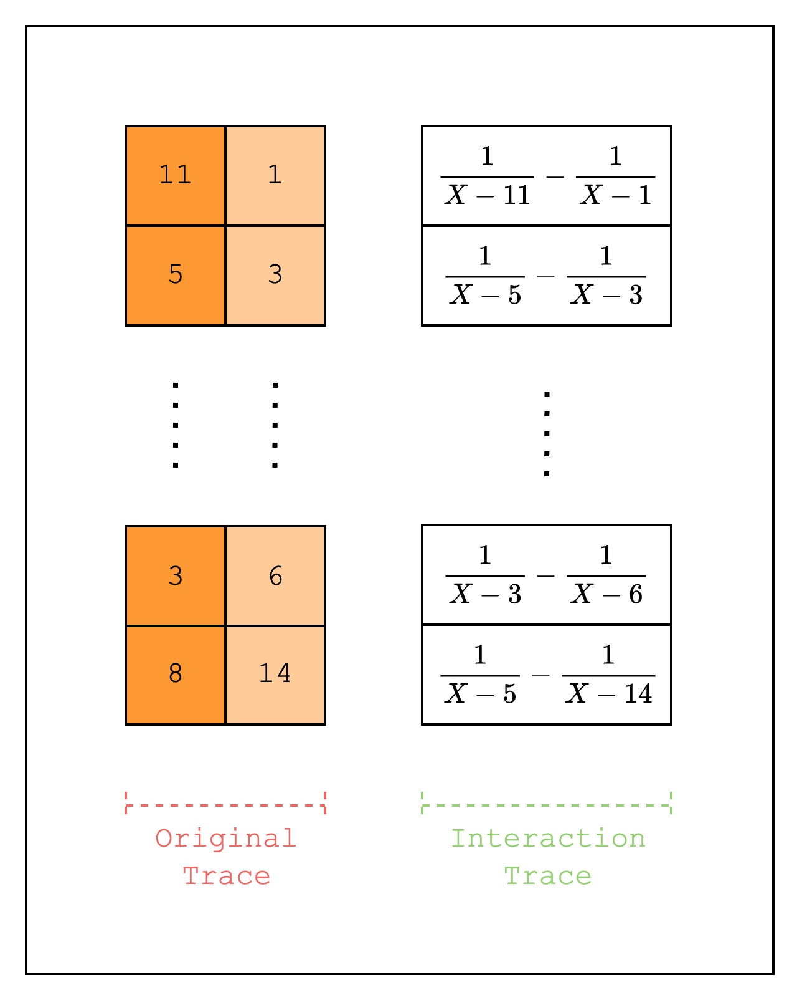

# Dynamic Lookups

In the last section, we implemented a static lookup. A dynamic lookup is the same as a static lookup except that the values that are being looked up are not known before the proving process (i.e. they are not preprocessed columns but trace columns).

In this section, we will implement one of the simplest dynamic lookups: a permutation check.

A permutation check simply checks that two sets of values have the same elements, but not necessarily in the same order. For example, the values `[1, 2, 3]` and `[3, 1, 2]` are a permutation of each other, but `[1, 2, 3]` and `[1, 2]` are not.

If you went through the previous section, you should have a good intuition for how to implement this. First, create two original trace columns that each contain a random permutation of the same set of values. Then, create a LogUp column where the first original trace column is added as a fraction with multiplicity \\(1\\) and the second original trace column is added as a fraction with multiplicity \\(-1\\). Then, check that the `claimed_sum`, or the sum of the fractions in the two LogUp columns, is \\(0\\).

<figure id="fig-permutation-check" style="text-align: center;">
    
    <figcaption><center><span style="font-size: 0.9em">Figure 1: Permutation check</span></center></figcaption>
</figure>

Let's move on to the implementation.

```rust,ignore
{{#include ../../../stwo-examples/examples/dynamic_lookups.rs:gen_trace}}

{{#include ../../../stwo-examples/examples/dynamic_lookups.rs:main_start}}
    ...
{{#include ../../../stwo-examples/examples/dynamic_lookups.rs:gen_trace_main}}
    ...
{{#include ../../../stwo-examples/examples/dynamic_lookups.rs:main_end}}
```

Looking at the code above, we can see that it looks very similar to the implementation in the previous section. Instead of creating a preprocessed column, we create two columns where the first column is a random permutation of values `[0, 1 << log_size)` and the second column contains the values in order. Note that this is equivalent to "looking up" all values in the first trace column once. And since all the values are looked up only once, we do not need a separate multiplicity column.

Then, we create a LogUp column that contains the values \\(\\frac{1}{original} - \\frac{1}{permuted}\\).

```rust,ignore
{{#include ../../../stwo-examples/examples/dynamic_lookups.rs:test_eval}}
```

The `TestEval` struct is also very similar to the one in the previous section. The only difference is that we call `add_to_relation` twice and add them together by calling `finalize_logup_in_pairs()` on the `TestEval` instance. This is equivalent to calling the `finalize_logup_batched` function with `&vec![0, 0]`.
