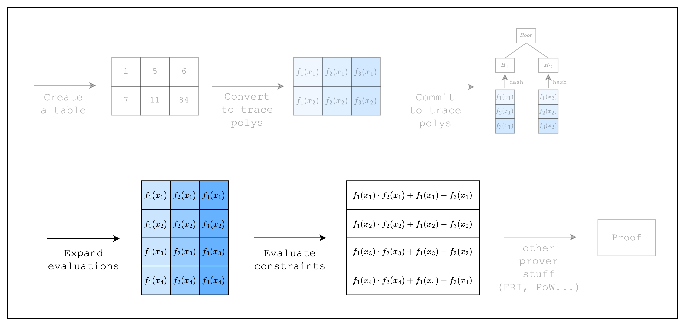

# Expressing Spreadsheet Functions as Constraints

<figure id="fig-spreadsheet-functions-as-constraints-1">
    
    <figcaption><center><span style="font-size: 0.9em">Figure 1: Prover workflow: Constraints</span></center></figcaption>
</figure>

When we want to perform computations over the cells in a spreadsheet, we don't want to manually fill in the computed values. Instead, we leverage spreadsheet functions to autofill cells based on a given computation.

We can do the same thing with our table, except in addition to autofilling cells, we can also create a constraint that the function was computed correctly. Remember that the purpose of using a proof system is that the verifier can verify a computation was executed correctly without having to execute it themselves? Well, that's why we need to create a constraint.

Now let's say we want to add a new column `C` to our spreadsheet that computes the product of the previous columns plus the first column. We can set `C1` as `A1 * B1 + A1` as in [Figure 1](#fig-spreadsheet-functions-as-constraints-1).

In the same vein, we can create a new column in our table that computes the sum of the two previous columns. And we create a constraint for this computation as a mathematical equation of addition and multiplication: `col1_row1 * col2_row1 + col1_row1 - col3_row1 = 0`.

<figure id="fig-spreadsheet-functions-as-constraints-2">
    
    <figcaption><center><span style="font-size: 0.9em">Figure 2: From spreadsheet function to table AIR</span></center></figcaption>
</figure>

Now let's implement this in our project.

```rust,ignore
{{#include ../../../stwo-examples/examples/spreadsheet_functions_as_constraints.rs}}
```

First, we add a new column `col_3` as follows: `col_1 * col_2 + col_1`.

To create a constraint over these columns, we need to first create a `TestEval` struct that implements the `FrameworkEval` trait. Then, we can add our constraint logic in the `FrameworkEval::evaluate` function.

Inside the function, we call `eval.next_trace_mask()` function three times to get the cell values of all three columns. Once we retrieve all three column values, we create a constraint of the form `col_1 * col_2 + col_1 - col_3 = 0`. Note that `evaluate` will be run for each row in the table, so we only need to define the constraint once. See [Figure 2](#fig-spreadsheet-functions-as-constraints-2) below for a visual representation.

<figure id="fig-spreadsheet-functions-as-constraints-3">
    
    <figcaption><center><span style="font-size: 0.9em">Figure 3: Evaluate function</span></center></figcaption>
</figure>

Another function to note is `max_constraint_log_degree_bound`. We add 1 to the `log_size` of the table because our constraint contains a multiplication. For those who are interested, we go into more detail in [the next section](from-spreadsheet-to-trace-polynomials.md#max_constraint_log_degree_bound).

Using the new `TestEval` struct, we can create a new `FrameworkComponent::<TestEval>` component. For now, we can ignore the `location_allocation` and `claimed_sum` parameters.

Note that we created the logic for the constraints but they are not connected with the table yet. We will do that in the following sections.
