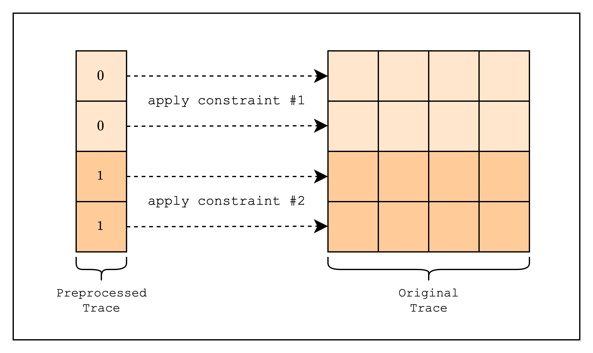

# Preprocessed Trace

> This section and the following sections are intended for developers who have completed the [First Breath of AIR](../writing-a-simple-air/index.md) section or are already familiar with the workflow of creating an AIR. If you have not gone through the previous section, we recommend you to do so first as the following sections gloss over a lot of boilerplate code.

For those of you who have completed the [First Breath of AIR](../writing-a-simple-air/index.md) tutorial, you should now be familiar with the concept of a trace as a table of integers that are filled in by the prover (we will now refer to this as the **original trace**).

In addition to the original trace, Stwo also has a concept of a **preprocessed trace**, which is a table whose values are fixed and therefore cannot be arbitrarily chosen by the prover. In other words, these are columns whose values are known in advance of creating a proof and essentially agreed upon by both the prover and the verifier.

One of the use cases of the preprocessed trace is as _a selector for different constraints_. Remember that in an AIR, the same constraints are applied to every row of the trace? If we go back to the spreadsheet analogy, this means that we can't create a spreadsheet that runs different computations for different rows. To get around this, note that if we multiply a constraint with a "selector" that is zero, the constraint will be trivially satisfied. Building on this, we can create a selector column of 0s and 1s, and multiply the constraint with the selector column. For example, let's say we want to create a constraint that runs different computations for the first 2 rows and the next 2 rows. We can do this by creating a selector column that has value 0 for the first 2 rows and 1 for the next 2 rows and combining it with the constraints as follows:

$$
(1 - \text{selector}) \cdot \text{constraint}_1 + \text{selector} \cdot \text{constraint}_2 = 0
$$

<figure id="fig-preprocessed-trace-selector">
    
    <figcaption><center><span style="font-size: 0.9em">Figure 1: Preprocessed trace as a selector</span></center></figcaption>
</figure>

Another use case is to use the preprocessed trace for _expressing constant values used in the constraints_. For example, when creating a hash function in an AIR, we often need to use round constants, which the verifier needs to be able to verify or the resulting hash may be invalid. We can also "look up" the constant values as an optimization technique, which we will discuss in more detail in the next section.

In this section, we will explore how to implement a preprocessed trace as a selector, and we will implement the simplest form: a single `isFirst` column, where the value is 1 for the first row and 0 for all other rows.

```admonish
Boilerplate code is omitted for brevity. Please refer to the [full example code](https://github.com/zksecurity/stwo-book/blob/main/stwo-examples/examples/preprocessed_trace.rs) for the full implementation.
```

```rust,ignore
{{#include ../../../stwo-examples/examples/preprocessed_trace.rs:is_first_column}}
```

First, we need to define a `IsFirstColumn` struct that will be used as a preprocessed trace. We will use the `gen_column()` function to generate a `CircleEvaluation` struct that is 1 for the first row and 0 for all other rows. The `id()` function is needed to identify this column when evaluating the constraints.

```rust,ignore
{{#include ../../../stwo-examples/examples/preprocessed_trace.rs:main_start}}
    ...
{{#include ../../../stwo-examples/examples/preprocessed_trace.rs:gen_traces}}
    ...
{{#include ../../../stwo-examples/examples/preprocessed_trace.rs:main_end}}
```

Then, in our main function, we will create and commit to the preprocessed and original traces. For those of you who are curious about why we need to commit to the trace, please refer to the [Committing to the Trace Polynomials](../writing-a-simple-air/committing-to-the-trace-polynomials.md) section.

```rust,ignore
{{#include ../../../stwo-examples/examples/preprocessed_trace.rs:test_eval}}
```

Now that we have the traces, we need to create a struct that contains the logic for evaluating the constraints. As mentioned before, we need to use the `is_first_id` field to retrieve the row value of the `IsFirstColumn` struct. Then, we compose two constraints using the `IsFirstColumn` row value as a selector and adding them together.

If you're unfamiliar with how `max_constraint_log_degree_bound(&self)` should be implemented, please refer to [this note](../simplest-air/constraints-over-trace-polynomials.md#max_constraint_log_degree_bound).

```rust,ignore
{{#include ../../../stwo-examples/examples/preprocessed_trace.rs:main_start}}
    ...
{{#include ../../../stwo-examples/examples/preprocessed_trace.rs:create_component}}
{{#include ../../../stwo-examples/examples/preprocessed_trace.rs:main_end}}
```

Finally, we can create a `FrameworkComponent` using the `TestEval` struct and then prove and verify the component.
