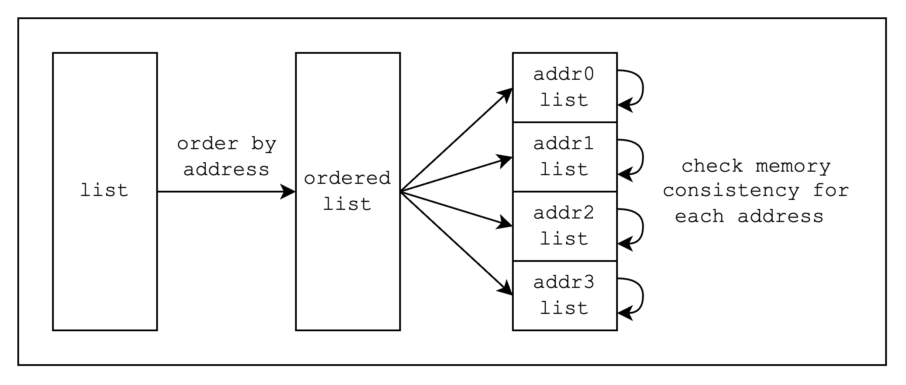

# AIR example walkthrough (Read-Write Memory)

In this section, we will show how to write an AIR using Stwo by going through an example of a read-write memory. To introduce the Stwo abstractions iteratively, we will write the AIR in 3 phases. But for those who want to jump right into the code, you can find the complete implementation [here](https://github.com/zksecurity/stwo-book/tree/air-example-rw-memory/stwo-examples/).

Before diving in, let's define our read-write memory. Say we have a VM that can read and write to memory, which is a key-value `(address, value)` mapping. Given a list of memory accesses where each memory access is a unique tuple `(rw_flag, address, value, counter)`, we want to prove that the list is valid.

So how do we determine that a list of memory accesses is valid? We simply need to check **read-write consistency**, that is, every read operation to address X returns a value that is equal to the last value written to the same address. In a non-AIR setting, we can check this efficiently by iterating over the list while maintaining a hashmap that stores the last value written to each address. Then, each read operation can be checked against the value in the hashmap. Since this is rather difficult to implement in an AIR setting, however, we will take a different approach of first sorting the list by addresses and checking memory consistency for each smaller list, as we can see in the following diagram.

<figure id="fig-read-write-memory-check">
  
  <figcaption>
Figure 1: Read-Write Memory check
</figcaption>
</figure>
