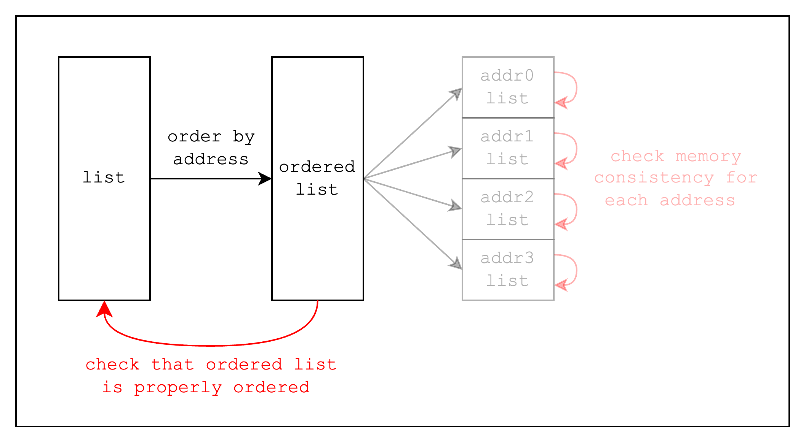
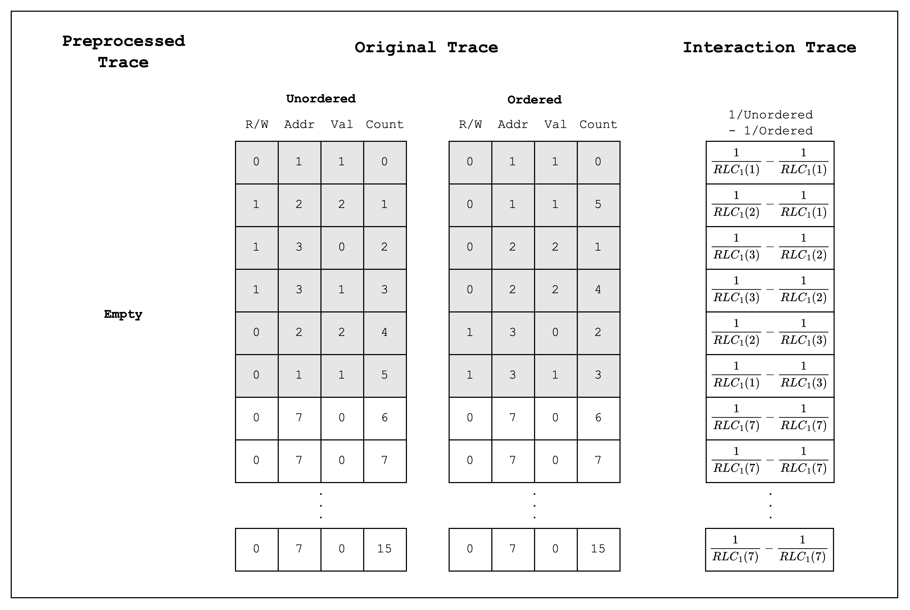

# Phase 1: Permutation Check

<figure id="fig-read-write-memory-check">
  
  <figcaption><center><span style="font-size: 0.9em">Figure 1: Read-Write Memory check</span></center></figcaption>
</figure>

To check read-write consistency, we need to first order our list by addresses. Then, we need to add a check that the ordered list is ordered correctly. Checking this in an AIR can be broken down into two parts:

1. check that the ordered list is a permutation of the unordered list, and
2. check that the previous row's address is always less than or equal to the current row's address.

```admonish exercise
Is there anything missing from the 2nd constraint?

Hint: the same constraints need to be satisfied for **every row** in the trace.
```

We will only be checking the first part in this phase, so the answer to the exercise will be revealed in the next phase.

For now, let's set up a list of memory accesses.

<figure id="fig-memory-op-list">
  
  <figcaption><center><span style="font-size: 0.9em">Figure 2: MemoryOp list</span></center></figcaption>
</figure>

Note that we only have 6 valid memory accesses, but we pad it with dummy accesses up to 16 rows because we want to use the `SimdBackend`, which requires a trace of length multiple of 16.

```rust,ignore
{{#include ../../../stwo-examples/examples/phase1.rs:memory_op}}

{{#include ../../../stwo-examples/examples/phase1.rs:main_start}}
{{#include ../../../stwo-examples/examples/phase1.rs:main_create_memory_ops}}
{{#include ../../../stwo-examples/examples/phase1.rs:main_end}}
```

Now let's create a function that takes in a list of memory accesses and returns a proof.

```rust,ignore
{{#include ../../../stwo-examples/examples/phase1.rs:prove_read_write_memory_fn_start}}
{{#include ../../../stwo-examples/examples/phase1.rs:prove_read_write_memory_fn_end}}

{{#include ../../../stwo-examples/examples/phase1.rs:main_start}}
    ...
{{#include ../../../stwo-examples/examples/phase1.rs:main_prove}}
{{#include ../../../stwo-examples/examples/phase1.rs:main_end}}
```

`log_size` is the log size of the trace that we want to prove, and we will explain how to construct `ReadWriteMemoryComponent` later, but for now, it is sufficient to note that it contains all the metadata about the AIR that we need to create and verify a proof.

## Setup

Now let's do some setup.

```rust,ignore
{{#include ../../../stwo-examples/examples/phase1.rs:constraint_log_expand}}

{{#include ../../../stwo-examples/examples/phase1.rs:prove_read_write_memory_fn_start}}
{{#include ../../../stwo-examples/examples/phase1.rs:setup}}
    ...
{{#include ../../../stwo-examples/examples/phase1.rs:prove_read_write_memory_fn_end}}
```

Diving into what each line of code does, `PcsConfig` contains parameters for the PoW and FRI part of the proving process, which are essential for optimizing our prover for different flavors (proving time, proof size, and verification time). However, for this example, we will simply use the default values.

`SimdBackend::precompute_twiddles` precomputes `twiddles`, which are the x-coordinates of the points on the circle domain that we want to use to interpolate our trace as polynomials. Note that the size of the `CanonicCoset` is not set as `log_size`, but rather `log_size + CONSTRAINT_LOG_EXPAND + config.fri_config.log_blowup_factor`. Essentially, we need to evaluate our trace over a larger domain to account for constraints with degree greater than 1 and FRI. The `CONSTRAINT_LOG_EXPAND` indicates the maximum log degree of the constraints and the `log_blowup_factor` is a FRI parameter that is not relevant to this example.

We also define a `CommitmentSchemeProver`, which is used to commit to the trace by creating a merkle tree using the trace as leaves.

Lastly, we need to create a `Channel`, which is required for the Fiat-Shamir transformation, where the transcript of the proving process (e.g. merkle root of the trace) is continuously mixed into the hash digest and we can draw elements from the current digest when we need randomness in our AIR.

## Original Trace

Now that we have our setup, let's create the trace.

<figure id="fig-traces-phase1">
  
  <figcaption><center><span style="font-size: 0.9em">Figure 3: Traces in Phase 1</span></center></figcaption>
</figure>

Above is an example diagram of the columns that we need to create for this phase. Note that in practice, we need to use a trace with `log_size` at least `LOG_N_LANES + 2 = 6`.

Stwo defines 3 types of traces: preprocessed, original, and interaction trace. The **preprocessed trace** refers to columns whose values are fixed in the AIR. The **original trace** refers to witness columns that the prover can populate and define custom constraints over. Finally, the **interaction trace** are also witness columns but they have fixed constraints that satisfy [LogUp](universal-air.md#logup).

In this phase, we don't need a preprocessed trace. Instead, we will create an original trace made up of 8 columns, where the first 4 are the unordered list of memory accesses, and the next 4 are the same list ordered by addresses. The following code shows how we can populate the original trace.

```rust,ignore
{{#include ../../../stwo-examples/examples/phase1.rs:constants}}

{{#include ../../../stwo-examples/examples/phase1.rs:memory_op}}

{{#include ../../../stwo-examples/examples/phase1.rs:lookup_data}}

{{#include ../../../stwo-examples/examples/phase1.rs:gen_trace}}
```

This is a lot of code, but all it does is create a trace, populate it with the unordered and ordered memory accesses, and create a `CircleEvaluation` instance for each column. The complexity in the code comes from using the `SimdBackend`, which supports SIMD operations with 16 lanes. This means we need to iterate over the trace in chunks of `N_LANES=16` and add each chunk to a `PackedM31` instance. For example, if our trace has 64 rows, we will have 4 chunks of 16 rows each.

We also define a `LookupData` struct that contains the unordered and ordered traces, since we will need them later to perform the permutation check using LogUp.

Now that we have generated our original trace, we need to commit to it.

```rust,ignore
{{#include ../../../stwo-examples/examples/phase1.rs:prove_read_write_memory_fn_start}}
    ...
{{#include ../../../stwo-examples/examples/phase1.rs:commit_trace}}
    ...
{{#include ../../../stwo-examples/examples/phase1.rs:prove_read_write_memory_fn_end}}
```

We don't have a preprocessed trace, but we still need to commit to an empty vector to keep the prover happy.

## Interaction Trace

Now that we have our original trace, we can create the interaction trace.

But first, we need to draw random elements from our `Channel`. Why? Because want to check that the unordered and ordered traces are permutations of each other, and we want to do it efficiently by reducing each memory access to a single field element. We can do this safely by performing a random linear combination of all the elements in the tuple `(rw_flag, address, value, counter)`.

Thus, we create a `ReadWriteMemoryLookupElements` struct that can draw random elements from our `Channel` and combine the 4 values of a single `MemoryOp` into a single field element.

```rust,ignore
{{#include ../../../stwo-examples/examples/phase1.rs:lookup_elements}}

{{#include ../../../stwo-examples/examples/phase1.rs:prove_read_write_memory_fn_start}}
    ...
{{#include ../../../stwo-examples/examples/phase1.rs:draw_lookup_elements}}
    ...
{{#include ../../../stwo-examples/examples/phase1.rs:prove_read_write_memory_fn_end}}
```

An astute reader might have noticed that the function `combine` takes in values of type `&[F]`, a slice of field elements, and outputs a value of a different type, `EF`. This is because the randomness should be generated in the extension field in Stwo, instead of the base field, the Mersenne-31 prime field. This is a characteristic of working in a small field (M31 has order $2^{31} - 1$), where the bits of security are not sufficiently high, so we need to sample from an extension field.

Now that we have both the `LookupData` and the `ReadWriteMemoryLookupElements`, we can generate the interaction trace.

```rust,ignore
{{#include ../../../stwo-examples/examples/phase1.rs:gen_interaction_trace}}
```

There are a few things to note here.

Firstly, we are batching two lookups into a single lookup by subtracting the lookup of the ordered trace from the lookup of the unordered trace (see [Figure 2](#fig-traces-phase1)). Remember that we want to prove that the ordered list is a permutation of the unordered list? We are basically adding the values from the unordered trace as a positive fraction and the values from the ordered trace as a negative fraction. This way, regardless of how the values are ordered, when we add all the fractions of each row together, the sum should equal 0.

For those who are familiar with the Grand Product Check, this is the same as expressing each row as a division $\frac{X-a_i}{X-b_i}$ and expecting the product of all the rows (i.e. $\prod_{i=0}^{n-1}\frac{X-a_i}{X-b_i}$) to equal 1.

Secondly, when creating a new lookup column, we need to create a new column using `logup_gen.new_col()`, populate it using `col_gen.write_frac()`, and then finalize it using `col_gen.finalize_col()`. And once all the columns are created, we need to call `logup_gen.finalize_last()`. Failing to call `finalize_col()` or `finalize_last()` will throw an error.

Once the interaction trace is finalized, we get the claimed sum, which is the sum of all the values in the interaction trace. In our case, it should be 0 if the ordered list is indeed a permutation of the unordered list. (Note that the final interaction trace looks a little different from the one in [Figure 2](#fig-traces-phase1) because there are a few additional operations done over the trace, but we won't go into the details here.)

Now that we have our interaction trace, we can commit to it.

```rust,ignore
{{#include ../../../stwo-examples/examples/phase1.rs:prove_read_write_memory_fn_start}}
    ...
{{#include ../../../stwo-examples/examples/phase1.rs:commit_interaction_trace}}
    ...
{{#include ../../../stwo-examples/examples/phase1.rs:prove_read_write_memory_fn_end}}
```

## Component

Now that we have our interaction trace, we can create a `ReadWriteMemoryComponent`, which, as we mentioned earlier, contains all the metadata needed to create and verify a proof.

```rust,ignore
{{#include ../../../stwo-examples/examples/phase1.rs:read_write_memory_component}}

{{#include ../../../stwo-examples/examples/phase1.rs:eval}}

{{#include ../../../stwo-examples/examples/phase1.rs:prove_read_write_memory_fn_start}}
    ...
{{#include ../../../stwo-examples/examples/phase1.rs:create_component}}
    ...
{{#include ../../../stwo-examples/examples/phase1.rs:prove_read_write_memory_fn_end}}
```

Note that we need to set a struct `ReadWriteMemoryEval` that implements the `FrameworkEval` trait when creating `ReadWriteMemoryComponent`. This struct contains the context and logic for evaluating the constraints.

Let's take a look at the functions in the `FrameworkEval` trait.

`max_constraint_log_degree_bound` refers to the log size of the evaluation domain. If any of the constraints have a degree higher than 1 (i.e. contains multiplication), we need to evaluate the trace over a larger domain that Stwo calls the evaluation domain. As a rule of thumb, the maximum degree of constraints needs to be less than or equal to `1 << CONSTRAINT_LOG_EXPAND`.

The `evaluate` function is called for each row of the trace and evaluates each constraint in the evaluation domain. We can add our custom constraints in the `evaluate_constraints` function, but in this phase, we don't have any, so we'll just add the constraints that are expected when we use the LogUp.

```rust,ignore
{{#include ../../../stwo-examples/examples/phase1.rs:evaluate_constraints}}
```

As [Figure 3](#fig-next-interaction-mask) below shows, calling `eval.next_interaction_mask(ORIGINAL_TRACE_IDX, [0])` multiple times will sequentially read the columns from the trace. Thus, we need to call it 8 times to read all 8 columns' values in a single row.

<figure id="fig-next-interaction-mask">
  
  <figcaption><center><span style="font-size: 0.9em">Figure 3: next_interaction_mask called 4 times</span></center></figcaption>
</figure>

Using the values we read from the trace, we will call `eval.add_to_relation` with the unordered trace as a positive multiplicity and another `eval.add_to_relation` with the ordered trace as a negative multiplicity. Calling `eval.finalize_logup_in_pairs()` will batch the two relations together, like we did when creating the interaction trace.

## Prove

Now that we have defined how to evaluate the constraints, we are finally ready to create a proof.

```rust,ignore
{{#include ../../../stwo-examples/examples/phase1.rs:prove_read_write_memory_fn_start}}
    ...
{{#include ../../../stwo-examples/examples/phase1.rs:prove}}
{{#include ../../../stwo-examples/examples/phase1.rs:prove_read_write_memory_fn_end}}
```

And that's it! We have created a proof that the ordered list is a permutation of the unordered list.

```

```
