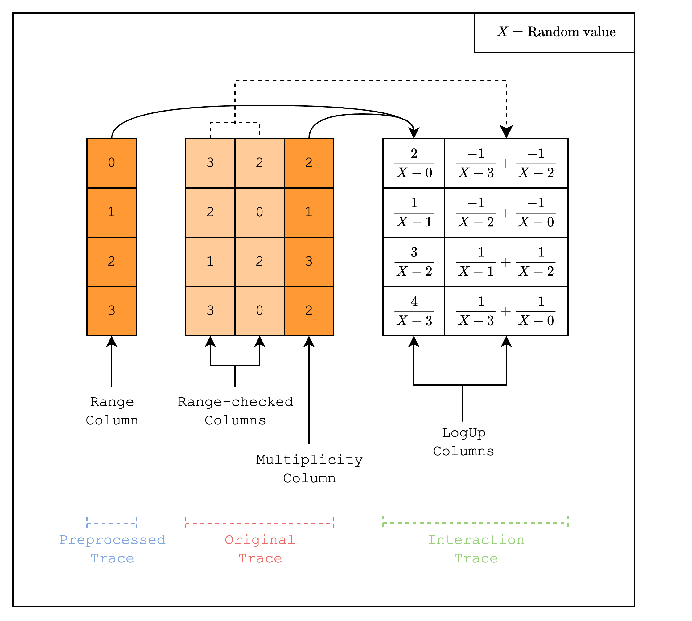
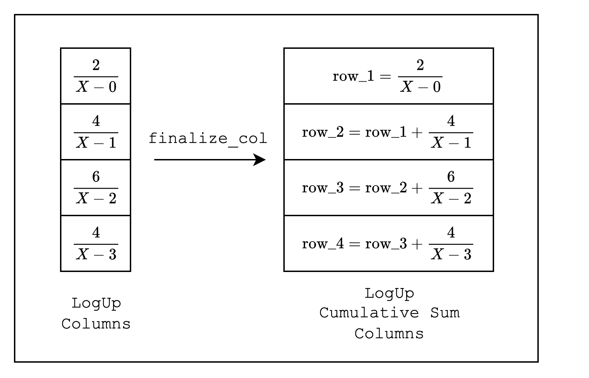

# Static Lookups

In the previous section, we showed how to create a preprocessed trace. In this section, we will introduce the concept of _static lookups_, where we will create columns that look up values from a preprocessed trace.

```admonish
Readers who are unfamiliar with the concept of lookups can refer to the [Lookups](../../how-it-works/lookups.md) section for a quick introduction.
```

Specifically, we will implement a **range-check**. A range-check is a technique used to check that a certain value is within a given range. This proves useful especially in proof systems like Stwo that uses finite fields because it allows checking for underflow and overflow.

A range-check checks that all values in a column are within a certain range. For example, as in [Figure 1](#fig-range-check), we can check that all values in the lookup columns are between 0 and 3. We do this by creating a multiplicity column that counts the number of times each value in the preprocessed trace appears in the lookup columns.

Then, we create two LogUp columns. The first column contains in each row a fraction where the nominator is the multiplicity and the denominator is the random linear combination of the value in the range-check column. For example, for row 1, the fraction should be \\(\dfrac{2}{X-0}\\). Note that in [Figure 1](#fig-range-check), the nominator is actually \\(-2\\), i.e. we apply a negation to the multiplicity, because we want the sum of the first column to be equal to the sum of the second column.

The second column contains fractions where the nominator is always 1 and the denominator is the random linear combination of the value in the lookup column. Note that a single row batches two lookup tables by adding two fractions together.

<figure id="fig-range-check" style="text-align: center;">
    
    <figcaption><center><span style="font-size: 0.9em">Figure 1: Range-check lookup</span></center></figcaption>
</figure>

If you stare at the LogUp columns hard enough, you'll notice that if we add all the fractions in the two columns together, we get 0. This is no coincidence! The prover will provide the sum of the LogUp columns and the verifier check in the open that this value is indeed 0.

Now let's move on to the implementation.

```rust,ignore
{{#include ../../../stwo-examples/examples/static_lookups.rs:range_check_column}}
```

First, we need to create the range-check column as a preprocessed column. This should look familiar to the code from the previous section.

```rust,ignore
{{#include ../../../stwo-examples/examples/static_lookups.rs:gen_trace}}
```

Next, we create the trace columns. The first two columns are random values in the range \\([0, 15]\\), and the third column contains the counts of the values in the range-check column.

```rust,ignore
{{#include ../../../stwo-examples/examples/static_lookups.rs:gen_logup_trace}}

{{#include ../../../stwo-examples/examples/static_lookups.rs:main_start}}
    ...
{{#include ../../../stwo-examples/examples/static_lookups.rs:logup_start}}
    ...
{{#include ../../../stwo-examples/examples/static_lookups.rs:main_end}}
```

Now we need to create the LogUp columns.

First, note that we are creating a `LookupElements` instance using the macro `relation!`. This macro creates an API for performing random linear combinations. Under the hood, it creates two random values \\(z, \alpha\\) that can create a random linear combination of an arbitrary number of elements. In our case, we only need to combine one value (value in \\([0,15]\\)), which is why we pass in `1` to the macro.

Inside `gen_logup_trace`, we create a `LogupTraceGenerator` instance. This is a helper class that allows us to create LogUp columns. Every time we create a new column, we need to call `new_col()` on the `LogupTraceGenerator` instance.

You may notice that we are iterating over `BaseColumn` in chunks of 16, or `1 << LOG_N_LANES` values. This is because we are using the `SimdBackend`, which runs 16 lanes simultaneously, so we need to preserve this structure. The `Packed` in `PackedSecureField` means that it packs 16 values into a single value.

You may also notice that we are using a `SecureField` instead of just the `Field`. This is because the random value we created in `LookupElements` will be in the degree-4 extension field \\(\mathbb{F}\_{p^4}\\). Interested readers can refer to the [Mersenne Primes](../../how-it-works/mersenne-prime.md) section for more details.

Once we set the fractions for each `simd_row`, we need to call `finalize_col()` to finalize the column. This process modifies the LogUp columns from individual fractions to cumulative sums of the fractions as shown in [Figure 2](#fig-finalize-col).

<figure id="fig-finalize-col" style="text-align: center;">
    
    <figcaption><center><span style="font-size: 0.9em">Figure 2: Finalizing each LogUp column</span></center></figcaption>
</figure>

Finally, we need to call `finalize_last()` on the `LogupTraceGenerator` instance to finalize the LogUp columns, which will return the LogUp columns as well as the sum of the fractions in the LogUp columns.

```rust,ignore
{{#include ../../../stwo-examples/examples/static_lookups.rs:test_eval}}
```

The last piece of the puzzle is to create the constraints. We use the same `TestEval` struct as in the previous sections, but the `evaluate` function will look slightly different. Instead of calling `add_constraint` on the `EvalAtRow` instance, we will call `add_to_relation`, which recreates the fractions that we added in the LogUp columns using values in the range-check, lookup, and multiplicity columns.

Once we add the fractions as constraints, we call the `finalize_logup_batched` function, which indicates how we want to batch the fractions. In our case, we added 3 fractions but want to create batches where the last two fractions are batched together, so we pass in `&vec![0, 1, 1]`.

```rust,ignore
{{#include ../../../stwo-examples/examples/static_lookups.rs:verify}}
```

When we verify the proof, as promised, we check that the `claimed_sum`, which is the sum of the fractions in the LogUp columns, is 0.

And that's it! We have successfully created a static lookup for a range-check.
