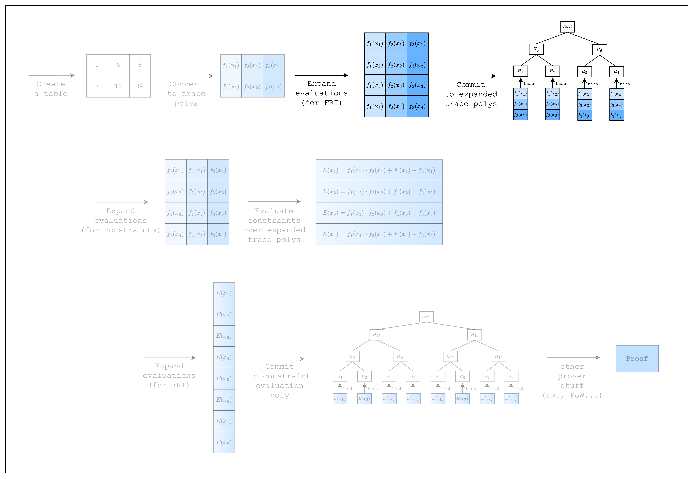

# Committing to the Trace Polynomials

<figure id="fig-committing-to-the-trace-polynomials-1">
    
    <figcaption><center><span style="font-size: 0.9em">Figure 1: Prover workflow: Commitment</span></center></figcaption>
</figure>

Now that we have created the trace polynomials, we need to commit to them using a merkle tree.

This is part of the implementation of FRI and readers who are interested in learning more about how commitments in FRI work can refer to the section on Circle-STARKs. For the purposes of this tutorial, however, it suffices to know that we need to

1. expand the number of evaluations of the trace polynomials by a blowup factor agreed upon by the prover and verifier, and
2. commit to the expanded evaluations using a merkle tree, where each leaf is a hash of the evaluation of all trace polynomials at a given point.

[Figure 1](#fig-committing-to-the-trace-polynomials-1) shows the trace polynomials being expanded by a factor of 2 and then being committed using a merkle tree.

Now, let's see how we can implement this in code.

```rust,ignore
{{#include ../../../stwo-examples/examples/committing_to_the_trace_polynomials.rs}}
```

First, we need to do some setup.

We create a `PcsConfig` instance, which sets various parameters for FRI and PoW operations. Both are related to the security of the proof, but for now we can just use the default values.

We also need to precompute twiddles, which are the \\(x_i\\) values that represent each row in the table and on which the trace polynomials will be interpolated. This value is set to `log_num_rows + CONSTRAINT_EVAL_BLOWUP_FACTOR + config.fri_config.log_blowup_factor`, and we talked about why `config.fri_config.log_blowup_factor` is needed above. The `CONSTRAINT_EVAL_BLOWUP_FACTOR` will be explained in the next section.

The final setup is to create a commitment scheme and a channel. The commitment scheme will be used to commit to the trace polynomials, and the channel will be used to hash the commitments (i.e. merkle roots) and other information in the proving process (i.e. transcript) so that it can be used to draw random values for Fiat-Shamir transformation.

Now that we have our setup, we can commit to the trace polynomials. Note that we need to commit to the preprocessed trace polynomials first. We are not using this function in this tutorial, so it is an empty vector, but Stwo requires that we commit to it nevertheless.

Let's move on to how we can create constraints over the trace polynomials!
