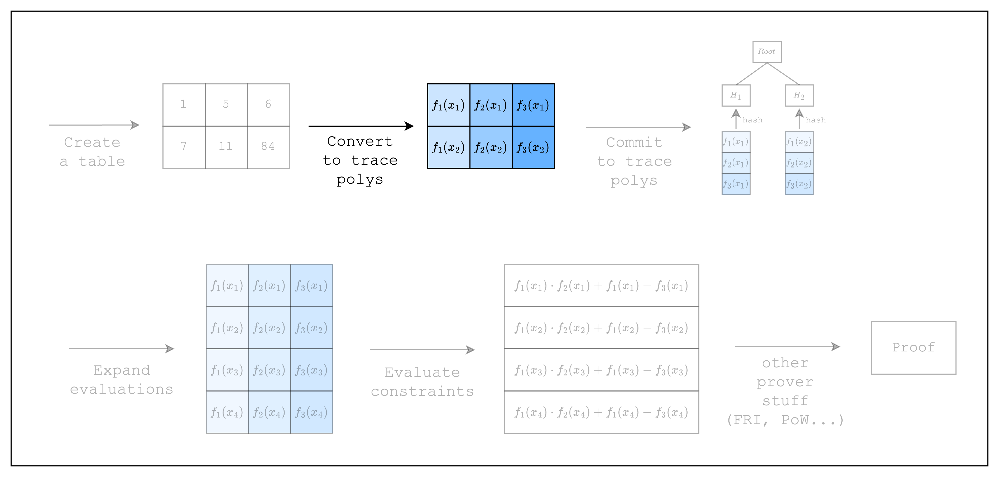

# From Spreadsheet to Trace Polynomials

<figure id="fig-from-spreadsheet-to-trace-polynomials-1">
    
    <figcaption><center><span style="font-size: 0.9em">Figure 1: Prover workflow: Trace polynomials</span></center></figcaption>
</figure>

In the previous section, we created a table (aka spreadsheet). In this section, we will convert the table into something called trace polynomials.

<figure id="fig-from-spreadsheet-to-trace-polynomials-2">
    
    <figcaption><center><span style="font-size: 0.9em">Figure 2: From spreadsheet to trace polynomials</span></center></figcaption>
</figure>

As we can see in [Figure 2](#fig-from-spreadsheet-to-trace-polynomials-2), the cells in each column of the table can be seen as evaluations of a Lagrange polynomial. A characteristic of a Lagrange polynomial is that interpolating $n$ distinct points will result in a unique polynomial of at most $n-1$. So if we set each row as a distinct point $x_i$, we can get a unique polynomial of degree $num\_rows-1$ for each column, which is also known as a **trace polynomial**.

We will explain why using a polynomial representation is useful in the next section, but for now, let's see how we can create trace polynomials for our code. Note that we are building upon the code from the previous section, so there's not much new code here.

```rust,ignore
{{#include ../../../stwo-examples/examples/from_spreadsheet_to_trace_polynomials.rs}}
```

Here, `domain` refers to the $x_i$ values used to interpolate the trace polynomials. For example, $x_1, x_2$ values in [Figure 1](#fig-from-spreadsheet-to-trace-polynomials-1) are the domain values for our example. We can ignore terms like `CanonicCoset` and `.circle_domain()` for now, but should note that the `log_num_rows` in `CanonicCoset::new(log_num_rows).circle_domain()` needs to be equal to the log of the actual number of rows that are used in the table.

Now that we have created 2 trace polynomials for our 2 columns, let's move on to the next section where we commit to those polynomials!
