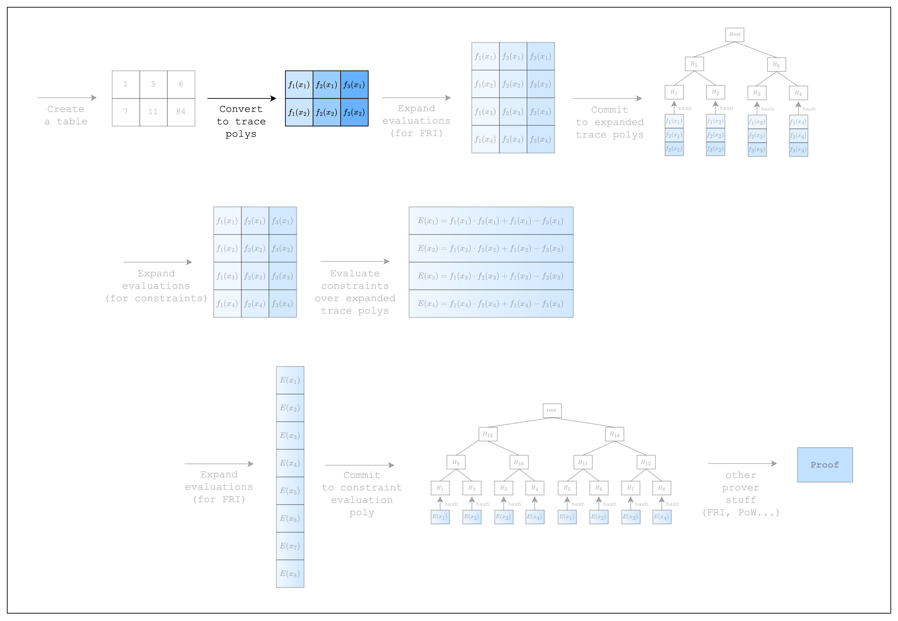

# From Spreadsheet to Trace Polynomials

<figure id="fig-from-spreadsheet-to-trace-polynomials-1">
    
    <figcaption><center><span style="font-size: 0.9em">Figure 1: Prover workflow: Trace polynomials</span></center></figcaption>
</figure>

In the previous section, we created a table (aka spreadsheet) and constraints but haven't connected the two together. The missing piece is that we need to convert the table into something called trace polynomials.

<figure id="fig-from-spreadsheet-to-trace-polynomials-2">
    
    <figcaption><center><span style="font-size: 0.9em">Figure 2: From spreadsheet to trace polynomials</span></center></figcaption>
</figure>

As we can see in [Figure 1](#fig-from-spreadsheet-to-trace-polynomials-1), the cells in each column of the table can be seen as evaluations of a Lagrange polynomial. A characteristic of a Lagrange polynomial is that interpolating $n$ distinct points will result in a unique polynomial of at most $n-1$. So if we set each row as a distinct point $x_i$, we can get a unique polynomial of degree $num\_rows-1$ for each column.These are what we call trace polynomials.

The advantage of using trace polynomials is that we can now express constraints over the cells of the table as constraints over polynomials. In other words, instead of creating separate constraints `col_1_row_n * col_2_row_n + col_1_row_n - col_3_row_n = 0` for every row, we can create a single constraint `f_1(x) * f_2(x) + f_1(x) - f_3(x) = 0`. One may ask why this is useful, and the short answer is that a constraint over polynomials can be verified with just a few evaluations (readers interested in learning more about this are encouraged to read the section on how Circle-STARKs work).

```admonish definition
Now is finally a good time to explain what a Algebraic Intermediate Representation (AIR) is.

*Algebraic* means that we are using polynomials to represent the constraints.

*Intermediate Representation* means that this is a modified representation of our statement, specifically so that it is efficient for proving.

So AIR is just another way of saying that we are representing statements to be proven as constraints over polynomials.
```

```admonish
We brushed over the idea that all the rows need to have the same constraints. This seems restrictive compared to, say a spreadsheet where we can define different functions for different rows. However, we will show in a later section on components how we can handle this kind of use-case.
```

Now, let's see how we can create trace polynomials for our example.

```rust,ignore
{{#include ../../../stwo-examples/examples/from_spreadsheet_to_trace_polynomials.rs}}
```

Here, `domain` refers to the $x_i$ values used to interpolate the trace polynomials. For example, $x_1, x_2$ values in [Figure 1](#fig-from-spreadsheet-to-trace-polynomials-1) are the domain values for our example. We can ignore terms like `CanonicCoset` and `.circle_domain()` for now, but should note that the `log_num_rows` in `CanonicCoset::new(log_num_rows).circle_domain()` needs to be equal to the log of the actual number of rows that are used in the table.

```admonish id="max_constraint_log_degree_bound"
In the previous section, we didn't fully explain why `FrameworkEval::max_constraint_log_degree_bound` needs to be equal to `log_num_rows + 1`. Now that we know that constraints are defined over polynomials, we can see that this is because a constraint with a multiplication has a degree higher than the trace polynomial by 1. E.g. $f_1(x) * f_2(x) + f_1(x) - f_3(x) = 0$ has a degree of 2 while $f_1(x)$ has a degree of 1.

For those who are still confused, here's a rule of thumb:
- calculate the degree of each constraint polynomial by counting the number of multiplications
- get the max degree of all constraint polynomials
- set `max_constraint_log_degree_bound` to `self.log_size + max_degree - 1`
```

Now that we have created 3 trace polynomials for our 3 columns, we're ready to actually prove that the constraints over those polynomials are satisfied!
