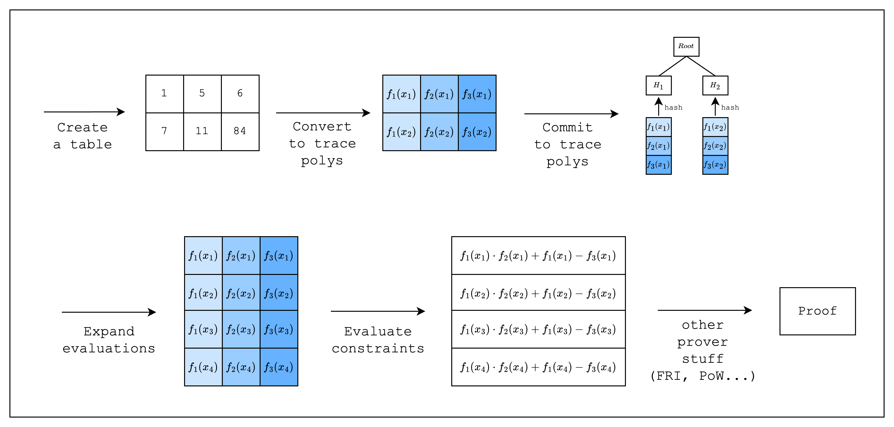

# Tutorial

> This section is intended for developers who want to learn how to write an AIR from scratch using Stwo. Please refer to the [Example Walkthrough (Read-Write Memory)](../read-write-memory-air-example/index.md) section if you have some experience writing AIRs in Stwo and just want to see a practical example.

<figure id="fig-tutorial-1">
    
    <figcaption>
Figure 1: Proving workflow
</figcaption>
</figure>

Welcome to the Stwo AIR tutorial!

In the following sections, we will go through the process of writing an AIR from scratch. This requires some understanding of the proving lifecycle in Stwo, so we added a diagram showing a high-level overview of the whole process. It omits details that are abstracted away by Stwo and some of the steps are handled internally by Stwo, but hopefully it should provide a sufficient explanation for all the code that we need to write in order to write an AIR.
