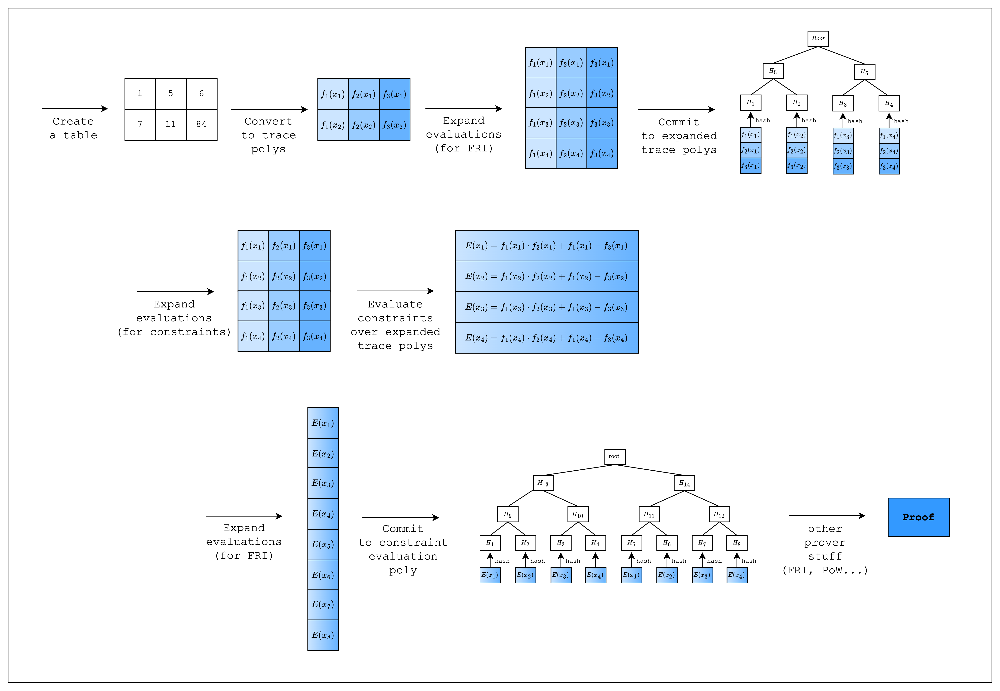

# Tutorial

> This section is intended for developers who want to learn how to write an AIR from scratch using Stwo. Please refer to the [Example Walkthrough (Read-Write Memory)](../read-write-memory-air-example/index.md) section if you have some experience writing AIRs in Stwo and just want to see a practical example.

<figure id="fig-tutorial-1">
    
    <figcaption>
Figure 1: Proving workflow
</figcaption>
</figure>

Welcome to Stwo AIR development tutorial!

Above is a diagram showing a high-level overview of the proving workflow. It omits some details that are abstracted away by Stwo but should be sufficient to show a general idea of how the code in our example works.

We will go through each step in detail in the following sections.
