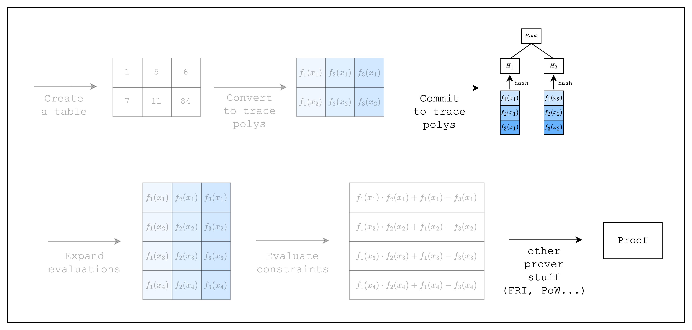

# Proving and Verifying an AIR

<figure id="fig-proving-an-air-1">
    
    <figcaption><center><span style="font-size: 0.9em">Figure 1: Prover workflow: perform FRI and PoW</span></center></figcaption>
</figure>

We're finally ready to take the final step--prove and verify an AIR!

Let us present the final code first and then go over the details.

```rust,ignore
{{#include ../../../stwo-examples/examples/proving_an_air.rs}}
```

## Prove

As we can see, there is only a single line of code added to create the proof. The `prove` function performs the FRI and PoW operations under the hood, although technically, the constraint related steps in [Figure 1](#fig-proving-an-air-1) were not performed in the previous section and are only performed once `prove` is called.

## Verify

Verifying a proof is much simpler and all we need to do is to perform some setup using the configs from the proof. For one, we need to set up to use the same commitment scheme and channel that we used when creating the proof. Then, we need to prepare the merkle tree verifier using the merkle roots (i.e. `proof.commitments`) and the heights of the merkle trees (i.e. `sizes`). After that, we can verify the proof using the `verify` function.

Congratulations! We have come full circle. We now know how to create a table, convert it to trace polynomials, commit to them, create constraints over the trace polynomials, and prove and verify the constraints (i.e. an AIR). In the following sections, we will go over some more complicated AIRs to explain Stwo's other features.

```admonish exercise
Try setting the dummy values in the table to 1 instead of 0. Does it fail? If so, why?
```
