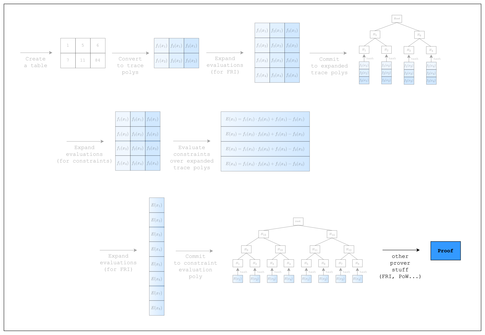

# Proving an AIR over the Trace

<figure id="fig-proving-an-air-1">
    
    <figcaption><center><span style="font-size: 0.9em">Figure 1: Workflow for proving an AIR over the trace</span></center></figcaption>
</figure>

We're finally ready to prove an AIR over the trace. As we can see in [Figure 1](#fig-proving-an-air-1) above, we haven't yet committed to the trace, so let's handle that as well.

⚠️ Warning: a lot of boilerplate code

```rust,ignore
{{#include ../../../stwo-examples/examples/proving_an_air.rs}}
```

First we need to do some setup. We create a default `PcsConfig`. These config values are used to configure the parameters for the FRI and PoW operations, which are not of much concern to us right now. We will resort to using the default values.

Twiddles are the related to the domain of the trace. They are essentially the $x_i$ values on which the trace polynomials are interpolated. The $x_i$ values are precomputed and cached since they will be used multiple times within the proving process. We need to set it to `log_num_rows + 1 + config.fri_config.log_blowup_factor` because this is the maximum number of $x_i$ values that we need during the proving process.

The final setup is for creating a commitment scheme and a channel. A commitment scheme is used to commit to the trace and also to hash the transcript of the proving process. The channel is used to draw random values using the hash of the transcript. We won't go into detail about these two, but it is worth noting that the same channel and commitment scheme types should be used by both the prover and the verifier.

Now that we have our setup, we need to commit to our trace. Note that we need to commit to an empty trace first. This first trace is referred to as a preprocessed trace, which we will explain in a later section. We don't use it, so it's empty, but we still need to commit to it.

Next, we commit to the original trace, which refers to the trace polynomials that we created in the previous section.

And finally, we run `prove`, which will expand the evaluations of the trace polynomials and evaluate the constraints, as can be seen in [Figure 1](#fig-proving-an-air-1).

```admonish exercise
Try setting the dummy values in the table to 1 instead of 0. Does it fail?
```

Now we have come full circle. We know how to create a table, convert it to a trace, and prove an AIR over the trace. In the following sections, we will go over some more complicated AIRs to explain Stwo's other features.

[Figure 1](./index.md#fig-introduction-1)
