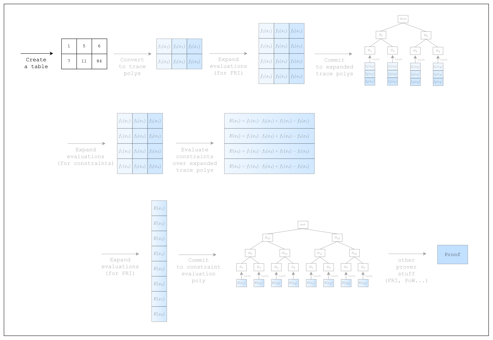
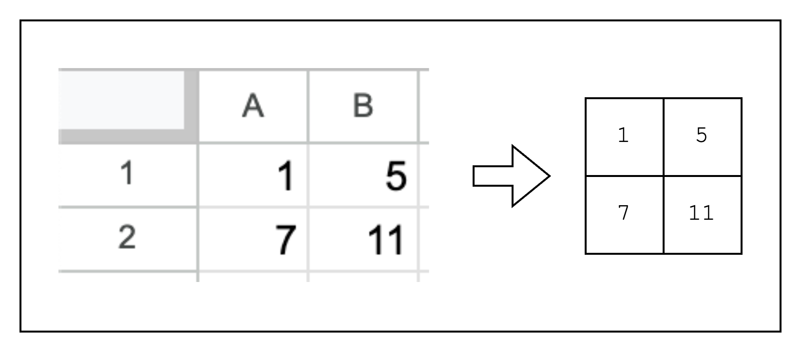
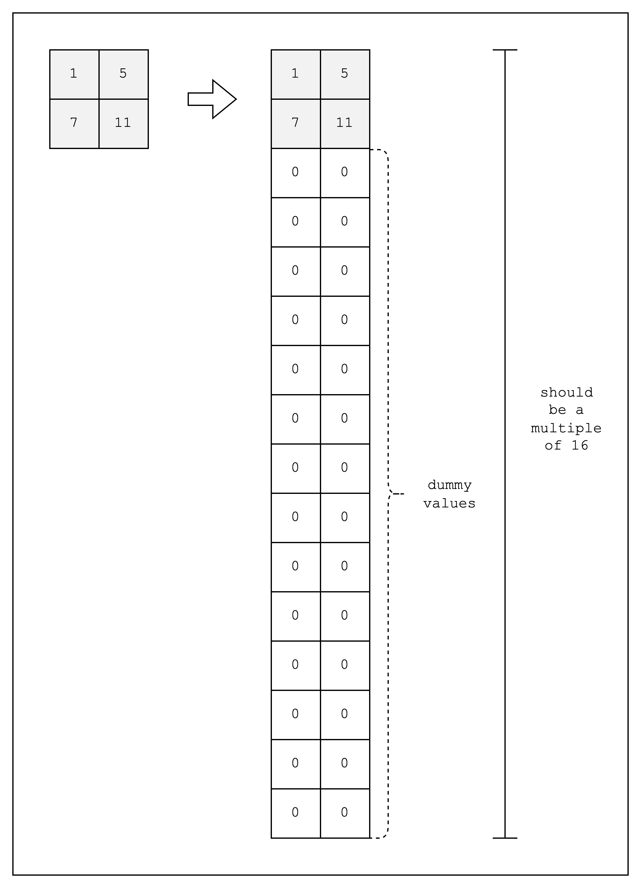

# Writing a Spreadsheet

<figure id="fig-writing-a-spreadsheet-1">
    
    <figcaption><center><span style="font-size: 0.9em">Figure 1: Prover workflow: Create a table</span></center></figcaption>
</figure>

In order to write a proof, we first need to create a table of rows and columns. An analogy we will continue throughout this introduction is that of an Excel spreadsheet with cells that contain integers.

<figure>
    
    <figcaption><center><span style="font-size: 0.9em">Figure 2: From spreadsheet to table</span></center></figcaption>
</figure>

As briefly mentioned in the [Why Stwo](../why-stwo.md) section, Stwo implements SIMD operations to speed up the prover in the CPU, and we can take advantage of that by using `SimdBackend`. This requires providing the table cells in chunks of 16, since under the hood Stwo runs 16 lanes, each of which contains a 32-bit integer, simultaneously. Fortunately, Stwo uses integers in the Mersenne-31 prime field, which is guaranteed to be a 32-bit integer, so all we need to do is provide the rows in chunks of 16 (we can do this for rows because every row runs the same computation, but that's for another section).

Alas, for our example, we will need to create 14 dummy rows to make the total number of rows equal to 16, as shown in [Figure 3](#fig-writing-a-spreadsheet-3). However, for the sake of simplicity, all the diagrams in the other sections will omit the dummy rows.

<figure>
    
    <figcaption><center><span style="font-size: 0.9em">Figure 3: From table to `SimdBackend` table</span></center></figcaption>
</figure>

Given all that, let's create this table in our project.

```rust,ignore
{{#include ../../../stwo-examples/examples/writing_a_spreadsheet.rs}}
```

As mentioned above, we instantiate the `num_rows` of our table as `N_LANES=16` to use the `SimdBackend`. Then we create a `BaseColumn` of `N_LANES=16` rows for each column and populate the first two rows with our values and the rest with dummy values.

Note that the values in the `BaseColumn` need to be of type `M31`, which refers to the Mersenne-31 prime field that Stwo uses. This means that the integers in the table must be in the range \\([0, 2^{31}-1]\\).

Now that we have our table, let's move on!
