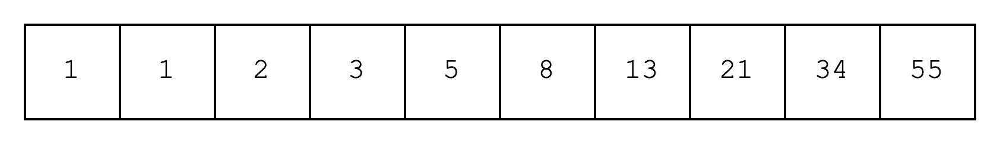
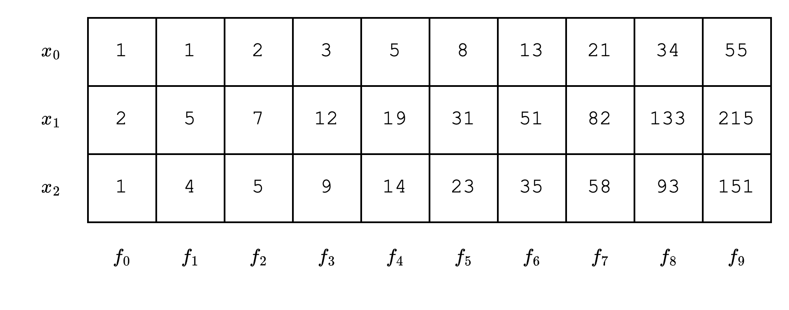

# Stwo as a Universal AIR Prover/Verifier

Stwo is designed as a universal framework for proving and verifying Algebraic Intermediate Representations (AIRs). It provides a flexible framework that allows developers to:

- Create an AIR that consists of a table and a set of constraints over the table
- Efficiently connect different columns of the table using lookups
- Create chips (i.e. custom AIRs) for specific computational tasks and compose them together using lookups

In this section, we'll introduce the concepts of AIRs, lookups, and chips, and in subsequent sections, we'll show how to use Stwo to create and prove them.

## AIRs

To understand AIRs, it's helpful to imagine a table with multiple rows and columns. Each cell of the table is filled with a field element and a set of constraints determine whether each field element is valid or not.

For example, we could create a Fibonacci AIR that contains all the Fibonacci numbers up to the 10th number in a single row and create a constraints for validating the Fibonacci sequence. We would need to create multiple constraints to be sure that the 10th column does indeed contain the 10th Fibonacci number:

1. The sum of the first and second columns are equal to the third column, the sum of the second and third columns are equal to the fourth column, and so on.
2. The initial values of the first two columns are both 1.

The result of this AIR is that the 10th column contains the 10th Fibonacci number, and thus we can use this value anywhere else in our proof system.

Now, this AIR isn't exactly efficient since we're creating 10 constraints for just 10 values (8 for constraint #1, 2 for constraint #2). But imagine we want to compute the 10th Fibonacci number sequence but for different inputs. For this, we can just add a new row that reuses the same constraints for constraint #1. This is achieved by creating a polynomial for each column, and creating constraints over these polynomials.

In this case, since constraint #1 remains the same, we're creating just 14 constraints in total (8 for constraint #1, 6 for constraint #2). And since constraint #1 is the same no matter how many rows we add, the efficiency starts to kick in as we add more rows.

The key point is that the constraints are applied identically across every row, which allows the prover to represent each column of the table as a polynomial, and then create constraints over these polynomials. This is the power of AIRs.

## Lookups

Lookups are simply a way to connect one part of the table to another. When we "look up" a value, we are doing nothing more than creating a constraint that allows us to use that value in another part of the table without breaking soundness.

Some use-cases of lookups include:

1. Prove equality: we want to prove that the values of the first column are equal to the values of the second column.
2. Prove permutation: we want to prove that the values of the first column are a permutation of the values of the second column.
3. Prove permutation with multiplicities: we want to prove that each value of the first column appears not just once but a certain number of times in the second column.

### LogUp

LogUp is a technique used to constrain lookups. It's a successor to Plookup, and is especially useful for proving permutation with multiplicities. Plookup and its variants use a technique called the Grand Product Check.

$$
\prod_{i=0}^{n-1} (X - a_i) = \prod_{i=0}^{n-1} (X - b_i)
$$

In the equation above, we can check that the set $\{a_0,...,a_{n-1}\}$ is a permutation of the set $\{b_0,...,b_{n-1}\}$ by setting $X$ to a random value provided by the verifier.

However, this becomes inefficient when we have multiplicities since we need to encode the multiplicities as powers of each lookup polynomial, and thus the degree of the polynomial increases linearly with the number of multiplicities.

$$
\prod_{i=0}^{n-1} (X - a_i) = \prod_{i=0}^{n-1} (X - b_i)^{m_i}
$$

On the other hand, LogUp uses the derivative of the Grand Product Check.

$$
\sum_{i=0}^{n-1} \frac{1}{X - a_i} = \sum_{i=0}^{n-1} \frac{m_i}{X - b_i}
$$

In this approach, each lookup polynomial is represented as a rational function with the multiplicity as the numerator. This transformation is significant because the degree of the polynomial remains constant regardless of the number of multiplicities, making LogUp more efficient for handling multiple lookups of the same value.

## Chips

Thanks to lookups, we now have a way to efficiently connect different columns of the table. We can combine this with AIRs to create chips.

A chip is a colloquial term for columns that serve a specific purpose. For example, a Poseidon chip refers to columns that compute just the Poseidon hash function. The first and last columns of this chip will be the input and output columns, respectively, but there are also columns in between that contain the intermediate values of the Poseidon hash function. (The Poseidon hash function has multiple rounds that require multiplication, so the degree of the constraint would be very high without these intermediate columns.)

For other columns that want to use this chip, however, the only columns of interest are the input and output columns. For instance, let's say there's a program that wants to hash certain inputs using Poseidon. It can "look up" the inputs and outputs from the Poseidon chip. A more intuitive way to understand this is that it can "send" its inputs to the Poseidon chip and then "receive" the hashed outputs back to use in its columns. The reason this is more efficient than computing the Poseidon hash function directly is that we can isolate the heavy computation of the Poseidon hash function from the main computation of the program. It can also help if we're hashing the same inputs multiple times in our program.
