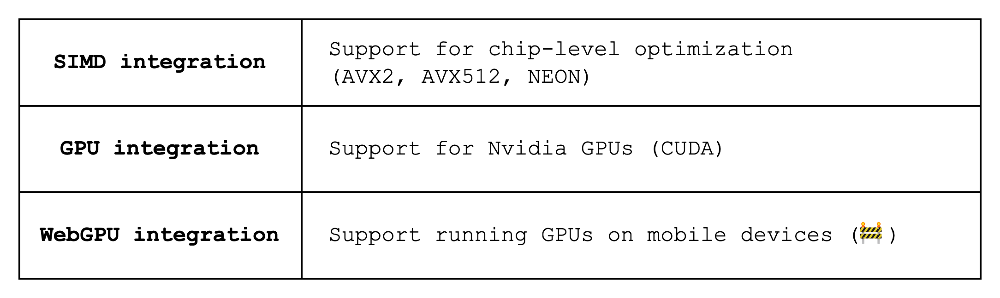

# Why Stwo?

So now that we know why we would want to use a proof system, why should we specifically use Stwo?

For one, Stwo is a STARK-based proof system, which provides a faster prover compared to SNARK-based proof systems like Circom and Halo2, although it does come with a trade-off of a larger proof size. The improvement in prover performance comes mainly from running the majority of the computation in a small prime field (32 bits); SNARKs, on the other hand, need to use big prime fields (e.g. 254-bit prime fields), which incur a lot of overhead as most computation does not require that many bits.

Even amongst the STARK-based proof systems, however, Stwo provides state-of-the-art performance by running the Mersenne-31 prime field (modulo $2^{31} - 1$), which is faster than another popular 32-bit prime field like BabyBear (modulo $2^{31} - 2^{27} + 1$). We suggest going through [this post](https://blog.zksecurity.xyz/posts/circle-starks-1/) for a breakdown of why this is the case.

In addition, Stwo represents statements in the Algebraic Intermediate Representation (AIR), which makes it flexible to prove various statements and is especially useful for proving statements that are repetitive (e.g. VMs, which essentially execute only one function).

Finally, Stwo offers various CPU and GPU optimizations as shown in [Figure 1](#fig-optimizations) below.

<figure id="fig-optimizations">
  
  <figcaption>
Figure 1: Prover performance optimizations in Stwo
</figcaption>
</figure>

_Note: As of the time of this writing, Stwo does not provide the "zero-knowledge" feature. "Zero-knowledge" here refers to the fact that the proof should not reveal any additional information other than the validity of the statement, which is not true for Stwo as it reveals to the verifier commitments to its witness values without hiding them by e.g. adding randomness. This reveals **some information** about the witness values, which may be used in conjunction with other information to infer the witness values._
