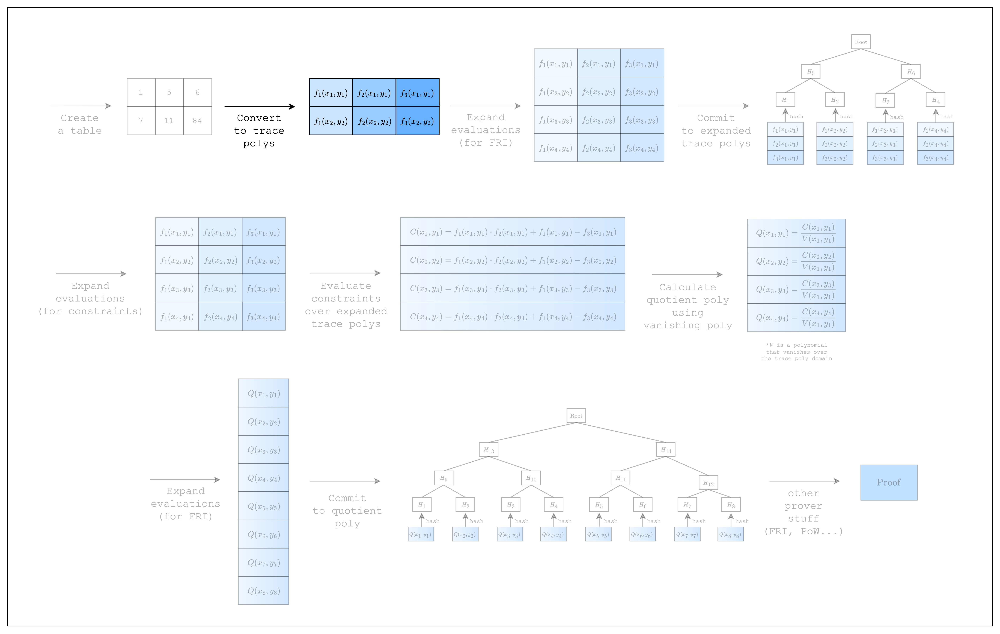

# From Spreadsheet to Trace Polynomials

<figure id="fig-from-spreadsheet-to-trace-polynomials-1">
    
    <figcaption><center><span style="font-size: 0.9em">Figure 1: Prover workflow: Trace polynomials</span></center></figcaption>
</figure>

In the previous section, we created a table (aka spreadsheet). In this section, we will convert the table into something called trace polynomials.

<figure id="fig-from-spreadsheet-to-trace-polynomials-2">
    
    <figcaption><center><span style="font-size: 0.9em">Figure 2: From spreadsheet to trace polynomials</span></center></figcaption>
</figure>

In STARKs, the computation trace is represented as evaluations of a polynomial over some domain. Typically this domain is a coset of a multiplicative subgroup. But since the multiplicative subgroup of M31 is not smooth, Stwo works over the circle group which is the subgroup of degree-2 extension of M31 (as explained in the [Mersenne Primes](../../how-it-works/mersenne-prime.md) and [Circle Group](../../how-it-works/circle-group.md) sections). Thus the domain in Stwo is formed of points $(x_i, y_i)$ on the circle curve. When interpolating a polynomial over the computation trace using the points on the circle curve as domain gives a bivariate trace polynomial $f_j(x, y)$.

We will explain why using a polynomial representation is useful in the next section, but for now, let's see how we can create trace polynomials for our code. Note that we are building upon the code from the previous section, so there's not much new code here.

```rust,ignore
{{#include ../../../stwo-examples/examples/from_spreadsheet_to_trace_polynomials.rs:main_start}}
{{#include ../../../stwo-examples/examples/from_spreadsheet_to_trace_polynomials.rs:main_end}}
```

Here, `domain` refers to the $(x_i, y_i)$ values used to interpolate the trace polynomials. For example, $(x_1, y_1), (x_2, y_2)$ in [Figure 2](#fig-from-spreadsheet-to-trace-polynomials-2) are the domain values for our example. Note that when creating the domain, we set the `log_num_rows` to the log of the actual number of rows that are used in the table. In our example, we set it to 4 since Stwo requires that we use at least 16 rows. For a background on what `CanonicCoset` and `.circle_domain()` mean, you can refer to the [Circle Group](../../how-it-works/circle-group.md) section.

Now that we have created 2 trace polynomials for our 2 columns, let's move on to the next section where we commit to those polynomials!
