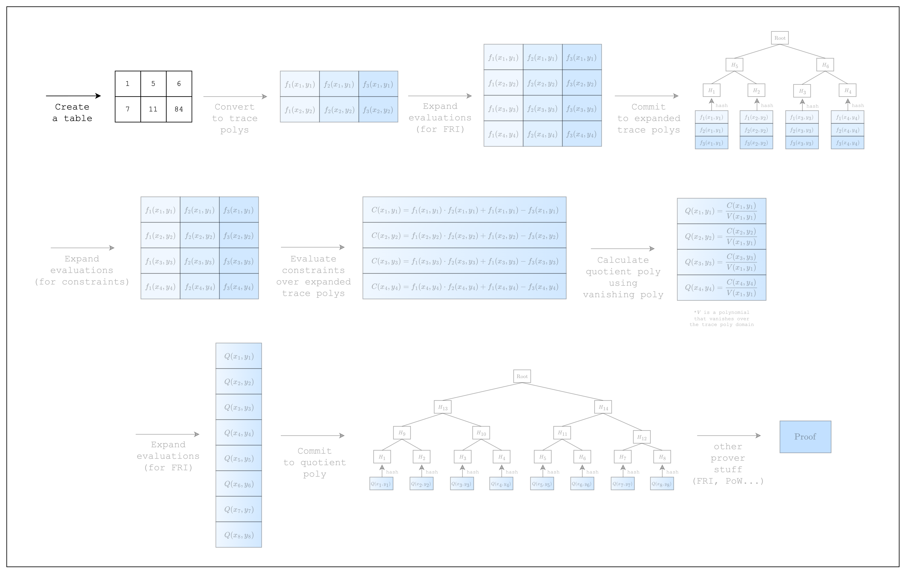

# Writing a Spreadsheet

<figure id="fig-writing-a-spreadsheet-1">
    
    <figcaption><center><span style="font-size: 0.9em">Figure 1: Prover workflow: Create a table</span></center></figcaption>
</figure>

In order to write a proof, we first need to create a table of rows and columns. This is no different than writing integers to an Excel spreadsheet as we can see in [Figure 2](#fig-writing-a-spreadsheet-2).

<figure id="fig-writing-a-spreadsheet-2">
    
    <figcaption><center><span style="font-size: 0.9em">Figure 2: From spreadsheet to table</span></center></figcaption>
</figure>

But there is a slight caveat to consider when creating the table. Stwo implements [SIMD operations](https://en.wikipedia.org/wiki/Single_instruction,_multiple_data) to speed up the prover in the CPU, but this requires providing the table cells in chunks of 16 rows. Simply put, this is because Stwo supports 16 lanes of 32-bit integers, which means that the same instruction can be run simultaneously for 16 different data.

Alas, for our table, we will need to create 14 dummy rows to make the total number of rows equal to 16, as shown in [Figure 2](#fig-writing-a-spreadsheet-3). For the sake of simplicity, however, we will omit the dummy rows in the diagrams of the following sections.

<figure id="fig-writing-a-spreadsheet-3">
    
    <figcaption><center><span style="font-size: 0.9em">Figure 3: Creating a table with 16 rows</span></center></figcaption>
</figure>

Given all that, let's create this table using Stwo.

```rust,ignore
{{#include ../../../stwo-examples/examples/writing_a_spreadsheet.rs}}
```

As mentioned above, we instantiate the `num_rows` of our table as `N_LANES=16` to accommodate SIMD operations. Then we create a `BaseColumn` of `N_LANES=16` rows for each column and populate the first two rows with our values and the rest with dummy values.

Note that the values in the `BaseColumn` need to be of type `M31`, which refers to the Mersenne-31 prime field that Stwo uses. This means that the integers in the table must be in the range $[0, 2^{31}-1)$.

Now that we have our table, let's move on!
