# Benchmarks

- Overview of zkVM and Proof Systems

| zkVM / Proof System   | Architecture   | Frontend   | Backend       | Security Bits |
|:----------------------|:---------------|:-----------|:--------------|:--------------|
| [RISC Zero](https://github.com/risc0/risc0)             | RISC-V         | Rust       | STARK-based   | 96 bits       |
| [SP1](https://github.com/succinctlabs/sp1)       | RISC-V         | Rust       | STARK-based   | 100 bits      |
| [OpenVM](https://github.com/openvm-org/openvm)       | RISC-V         | Rust       | STARK-based   | 100 bits      |
| [Jolt](https://github.com/a16z/jolt)                  | RISC-V         | Rust       | Lookup-based  | -             |
| [Stone](https://github.com/starkware-libs/stone-prover)                 | Cairo VM       | Cairo      | STARK-based   | 100 bits      |
| [Stwo](https://github.com/starkware-libs/stwo)                  | Cairo VM       | Cairo      | STARK-based   | 96 bits       |

- Stone benchmarks were generated using the `dynamic` layout with the following configurations:
    - Parameters - `fri_step_list` and `last_layer_degree_bound` change depending on the size of the computation but other parameters remain same

        ```
        {
            "field": "PrimeField0",
            "channel_hash": "keccak256",
            "commitment_hash": "keccak256_masked160_lsb",
            "n_verifier_friendly_commitment_layers": 0,
            "pow_hash": "keccak256",
            "statement": {
                "page_hash": "pedersen"
            },
            "stark": {
                "fri": {
                    "fri_step_list": [
                        0,
                        3,
                        3,
                        3,
                        3,
                        2
                    ],
                    "last_layer_degree_bound": 64,
                    "n_queries": 16,
                    "proof_of_work_bits": 20
                },
                "log_n_cosets": 5
            },
            "use_extension_field": false,
            "verifier_friendly_channel_updates": false,
            "verifier_friendly_commitment_hash": "poseidon3"
        }
        ```
    - Prover Config

        ```
        {
            "cached_lde_config": {
                "store_full_lde": true,
                "use_fft_for_eval": false
            },
            "constraint_polynomial_task_size": 256,
            "n_out_of_memory_merkle_layers": 0,
            "table_prover_n_tasks_per_segment": 32
        }
        ```
- Benchmarks which run out of memory have been indicate by `*` in the tables.


## Time and Commit Hash
- **Commit Hash**: af54d600aeb54e6dfb759d5f21edea97f751d6ca
- **Timestamp**: Saturday, May 03, 2025 11:30:02 UTC


## System Information

### OS Version
Ubuntu 24.04.2 LTS

### CPU Info

- **Architecture**: x86_64

- **CPU(s)**: 48

- **Model name**: AMD EPYC-Milan Processor

- **Thread(s) per core**: 2

- **Core(s) per socket**: 24

- **Socket(s)**: 1

- **L3 cache**: 32 MiB (1 instance)


### Memory Info

- **MemTotal**: 193203528 kB

- **MemFree**: 175792536 kB

- **MemAvailable**: 187777192 kB

- **Buffers**: 247436 kB

- **Cached**: 12738216 kB

- **SwapTotal**: 0 kB

- **SwapFree**: 0 kB


## Fibonacci
Benchmark `n` Fibonacci iterations.

### Prover Time (s)
| n      |   5000 |   10000 |   50000 | 100000   | 500000   | 1000000   |
|--------|--------|---------|---------|----------|----------|-----------|
| jolt   |  2.832 |   4.692 |  21.494 | 44.801   | *        | *         |
| sp1    |  9.214 |  11.363 |  42.164 | 40.407   | 145.703  | 260.258   |
| openvm | 42.566 |  52.81  |  97.515 | 189.898  | 665.982  | 1329.661  |
| r0     | 11.908 |  11.824 |  58.508 | 116.561  | 559.734  | 1118.37   |
| stone  | 16.725 |  23.36  | 103.766 | *        | *        | *         |
| stwo   |  8.638 |   8.836 |   9.815 | 10.228   | 15.756   | 24.701    |

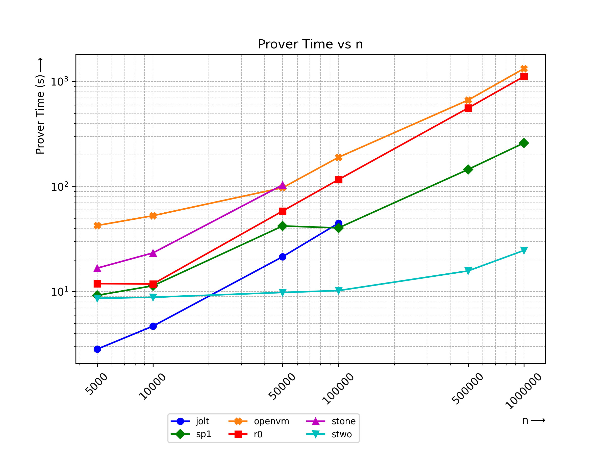

### Verifier Time (ms) 
| n      |   5000 |   10000 |   50000 | 100000   | 500000   | 1000000   |
|--------|--------|---------|---------|----------|----------|-----------|
| jolt   |     68 |      92 |      93 | 95.0     | *        | *         |
| sp1    |    188 |     187 |     194 | 424      | 1069     | 1966      |
| openvm |     59 |      59 |      59 | 60       | 63       | 120       |
| r0     |     20 |      20 |      34 | 54       | 218      | 437       |
| stone  |     97 |     113 |     115 | *        | *        | *         |
| stwo   |    104 |      80 |      81 | 83       | 80       | 81        |

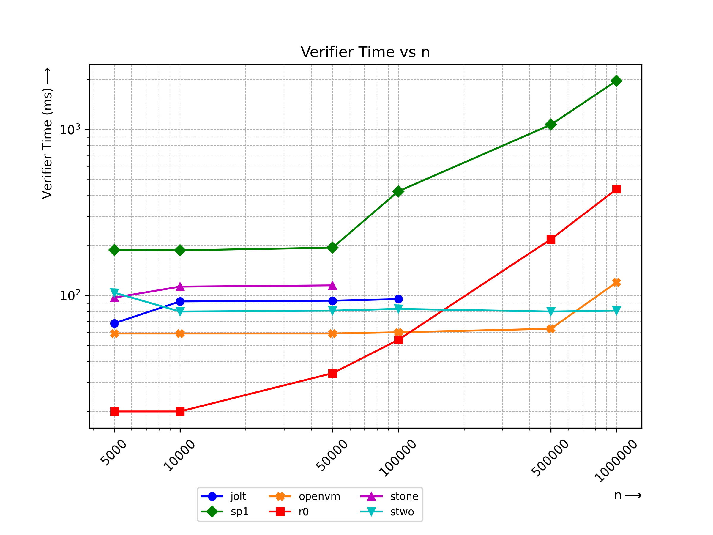

### Proof Size (KB)
| n      |     5000 |    10000 |    50000 | 100000   | 500000    | 1000000   |
|--------|----------|----------|----------|----------|-----------|-----------|
| jolt   |  176.231 |  185.998 |  217.8   | 229.232  | *         | *         |
| sp1    | 1799.8   | 1799.8   | 1955.06  | 4659.906 | 11713.054 | 21980.648 |
| openvm |  770.545 |  770.545 |  770.545 | 803.841  | 874.465   | 1703.818  |
| r0     |  255.93  |  255.93  |  537.18  | 830.654  | 3375.152  | 6750.152  |
| stone  |  109.032 |  109.48  |  128.008 | *        | *         | *         |
| stwo   |  712.624 |  713.948 |  721.732 | 715.32   | 734.296   | 772.404   |

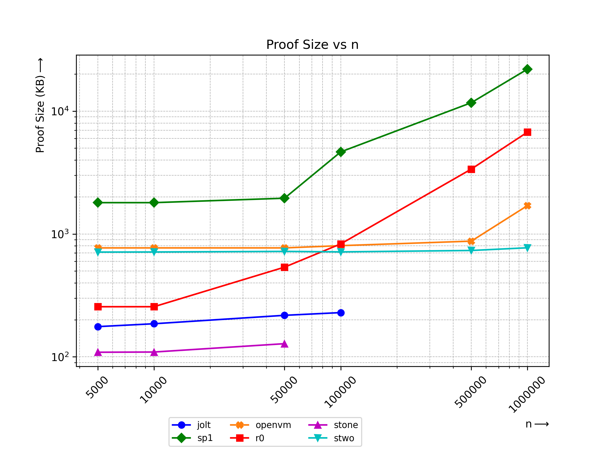

### Cycle Count
| n     |   5000 |   10000 |   50000 | 100000   | 500000   | 1000000   |
|-------|--------|---------|---------|----------|----------|-----------|
| jolt  | 121036 |  240973 | 1201051 | 2401051  | *        | *         |
| sp1   | 124682 |  244682 | 1204682 | 2404682  | 12004682 | 24004682  |
| r0    | 122278 |  242278 | 1202278 | 2402278  | 12002278 | 24002278  |
| stone |  30018 |   60018 |  300018 | *        | *        | *         |
| stwo  |  32767 |   65535 |  524287 | 1048575  | 4194303  | 8388607   |

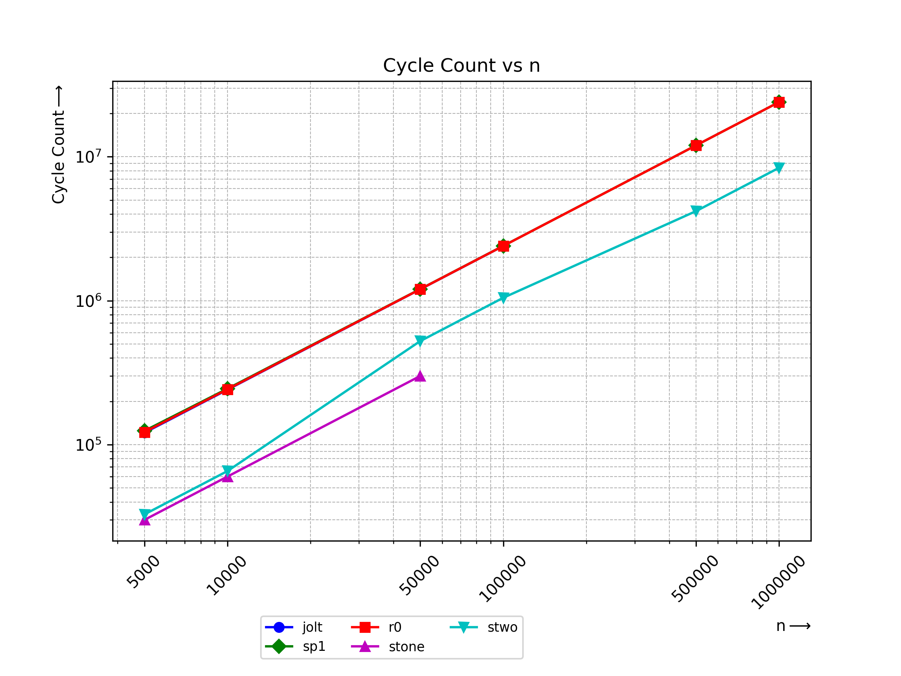

### Peak Memory (GB)
| n      |   5000 |   10000 |   50000 | 100000   | 500000   | 1000000   |
|--------|--------|---------|---------|----------|----------|-----------|
| jolt   |   5.52 |    6.24 |   30.57 | 57.94    | *        | *         |
| sp1    |   4.8  |    5.58 |   13.24 | 12.14    | 41.66    | 43.42     |
| openvm |   2.82 |    1.38 |    1.99 | 3.52     | 12.49    | 12.52     |
| r0     |   2.3  |    2.3  |    9.17 | 9.17     | 9.18     | 9.18      |
| stone  |  12.45 |   15.19 |  118.84 | *        | *        | *         |
| stwo   |   2.61 |    2.64 |    3.01 | 3.47     | 7.14     | 13.41     |

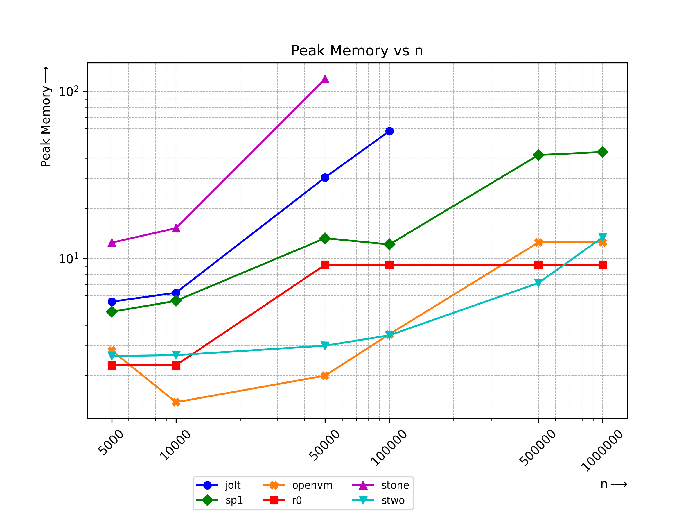


## Sha2
Benchmark Sha256 hash of `n` bytes. For Stone, the [cairo implementation of sha256](https://github.com/cartridge-gg/cairo-sha256) by cartridge was used for benchmarking and for other zkvms [sha2 Rust crate](https://crates.io/crates/sha2) was used for benchmarking.

### Prover Time (s)
| n                 |    256 |    512 |   1024 |   2048 | 4096   |
|-------------------|--------|--------|--------|--------|--------|
| jolt              |  2.03  |  2.154 |  2.773 |  4.359 | *      |
| sp1               |  8.177 |  8.201 |  9.166 | 10.929 | 14.577 |
| openvm            | 38.56  | 42.455 | 48.971 | 64.395 | 90.51  |
| r0                |  6.1   |  6.159 | 11.993 | 23.572 | 46.711 |
| stone             | 11.325 | 19.99  | 31.944 | 31.762 | 67.1   |
| stwo              |  3.951 |  4.15  |  4.2   |  3.951 | 4.739  |
| sp1-precompile    |  6.325 |  6.383 |  6.541 |  6.874 | 7.43   |
| r0-precompile     |  3.208 |  6.189 |  6.166 | 11.978 | 23.595 |
| openvm-precompile | 35.826 | 36.761 | 38.826 | 41.558 | 48.597 |

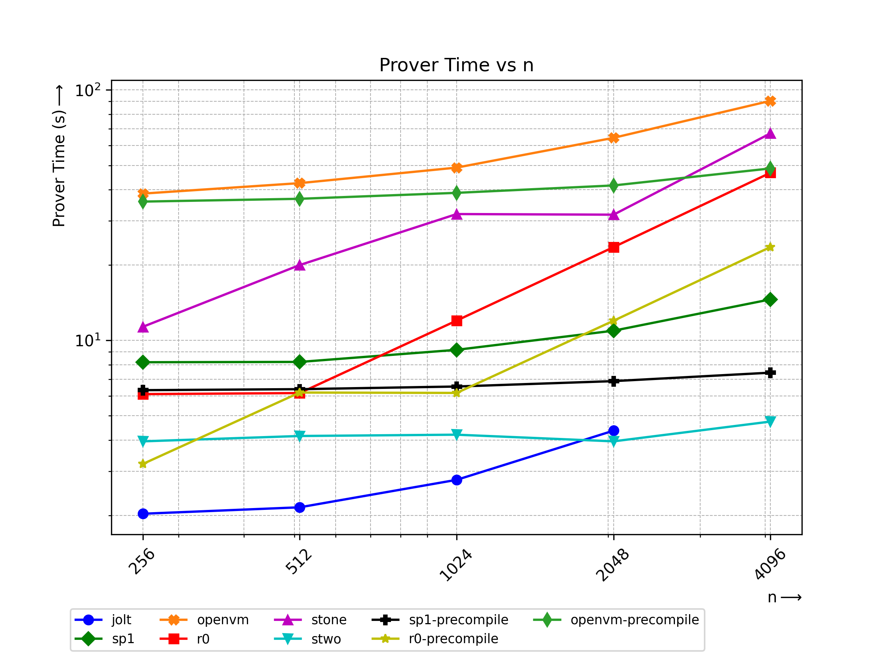

### Verifier Time (ms)
| n                 |   256 |   512 |   1024 |   2048 | 4096   |
|-------------------|-------|-------|--------|--------|--------|
| jolt              |    47 |    56 |     55 |     58 | *      |
| sp1               |   188 |   188 |    187 |    186 | 187    |
| openvm            |    65 |    65 |     65 |     65 | 65     |
| r0                |    15 |    19 |     20 |     21 | 20     |
| stone             |   422 |   411 |    429 |    399 | 413    |
| stwo              |    10 |    20 |     21 |     21 | 20     |
| sp1-precompile    |   526 |   525 |    526 |    537 | 539    |
| r0-precompile     |    20 |    20 |     20 |     20 | 20     |
| openvm-precompile |    88 |    88 |     88 |     88 | 88     |

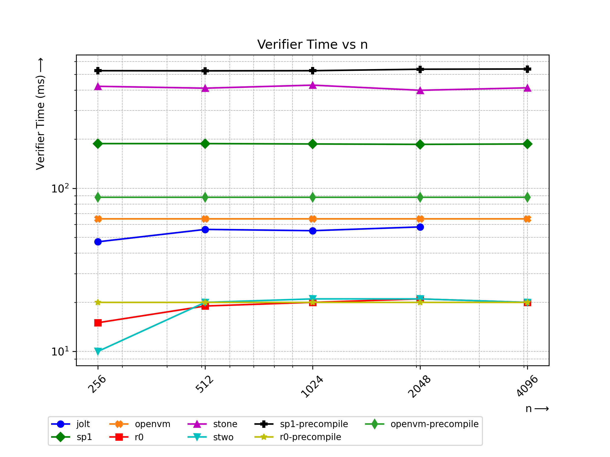

### Proof Size (KB)
| n                 |      256 |      512 |     1024 |     2048 | 4096     |
|-------------------|----------|----------|----------|----------|----------|
| jolt              |  170.796 |  171.052 |  180.916 |  191.708 | *        |
| sp1               | 1799.82  | 1799.82  | 1799.82  | 1799.82  | 1799.816 |
| openvm            |  811.409 |  811.409 |  811.409 |  811.409 | 811.409  |
| r0                |  244.442 |  244.442 |  256.154 |  268.378 | 281.626  |
| stone             |  109.288 |  112.36  |  119.528 |  116.776 | 126.344  |
| stwo              | 1009.88  | 1037.43  | 1039.64  | 1037.78  | 1046.324 |
| sp1-precompile    | 5674.59  | 5674.59  | 5674.59  | 5674.59  | 5674.593 |
| r0-precompile     |  221.402 |  244.442 |  244.442 |  256.154 | 268.378  |
| openvm-precompile |  950.873 |  950.873 |  950.873 |  950.873 | 950.873  |

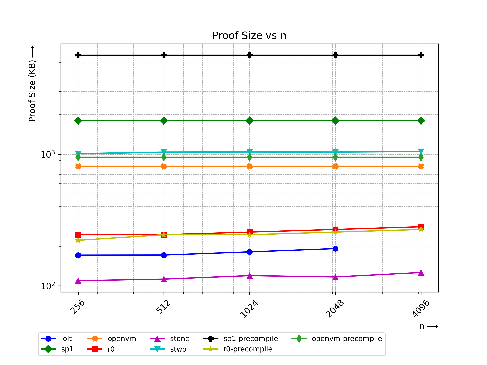

### Cycle Count
| n              |    256 |    512 |   1024 |   2048 | 4096   |
|----------------|--------|--------|--------|--------|--------|
| jolt           |  33342 |  57286 | 105174 | 200950 | *      |
| sp1            |  33132 |  52288 |  90600 | 167224 | 320472 |
| r0             |  48398 |  87266 | 165002 | 320474 | 631418 |
| stone          |  14780 |  29222 |  46284 |  80408 | 160478 |
| stwo           | 131071 | 131071 | 131071 | 131071 | 262143 |
| sp1-precompile |  11763 |  17115 |  27819 |  49227 | 92043  |
| r0-precompile  |  29627 |  53451 | 101117 | 196447 | 387090 |

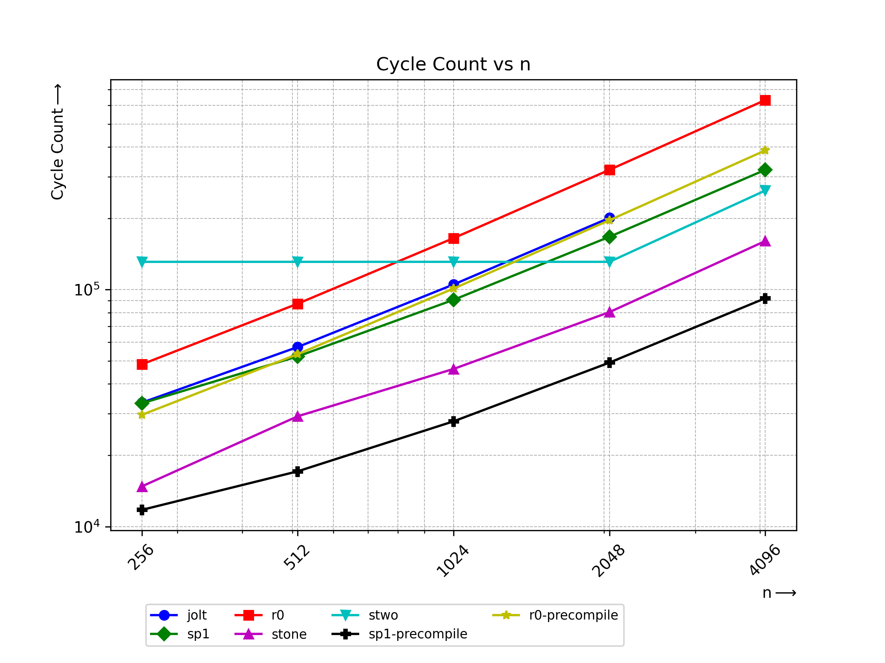

### Peak Memory (GB)
| n                 |   256 |   512 |   1024 |   2048 | 4096   |
|-------------------|-------|-------|--------|--------|--------|
| jolt              |  4.03 |  3.51 |   4.13 |   6.29 | *      |
| sp1               |  4.32 |  4.28 |   4.7  |   5.24 | 6.52   |
| openvm            |  1.23 |  1.27 |   1.35 |   1.53 | 1.87   |
| r0                |  1.15 |  1.16 |   2.3  |   4.59 | 9.15   |
| stone             |  9.63 | 18.9  |  35.72 |  35.71 | 71.45  |
| stwo              |  2.66 |  2.65 |   2.7  |   2.71 | 2.87   |
| sp1-precompile    |  4.34 |  4.52 |   4.39 |   4.71 | 4.9    |
| r0-precompile     |  0.58 |  1.15 |   1.16 |   2.3  | 4.59   |
| openvm-precompile |  1.19 |  1.19 |   1.21 |   1.25 | 1.34   |

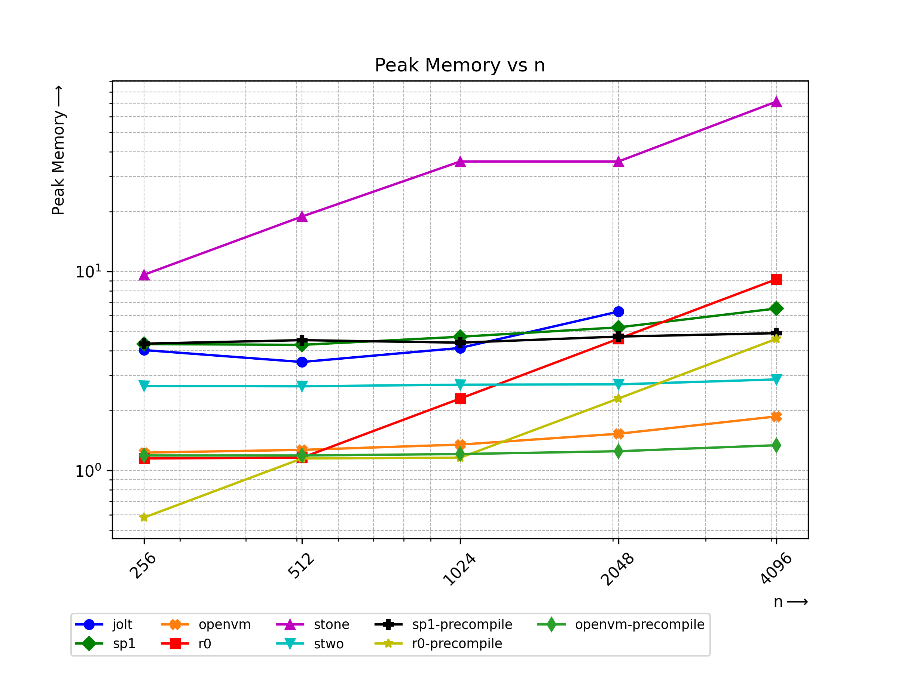

## Sha2-Chain
Benchmark Sha256 hash of 32 bytes for `n` iteration.

### Prover Time (s)
| n                 |      16 | 32     | 64     | 128     | 256     | 512     | 1024     |
|-------------------|---------|--------|--------|---------|---------|---------|----------|
| jolt              |   2.866 | 4.373  | 7.713  | 13.79   | 25.001  | 48.285  | 94.292   |
| sp1               |   9.291 | 11.037 | 14.678 | 23.552  | 43.047  | 44.656  | 71.693   |
| openvm            |  48.096 | 63.693 | 88.209 | 139.198 | 265.566 | 522.168 | 1041.351 |
| r0                |   6.183 | 11.977 | 23.61  | 46.678  | 58.683  | 116.88  | 233.6    |
| stone             | 118.744 | *      | *      | *       | *       | *       | *        |
| stwo              |   5.025 | 6.834  | 8.871  | 14.641  | 26.978  | *       | *        |
| sp1-precompile    |   6.482 | 6.471  | 6.969  | 7.926   | 10.969  | 16.804  | 30.702   |
| r0-precompile     |   3.207 | 3.232  | 6.126  | 6.23    | 11.968  | 23.595  | 46.923   |
| openvm-precompile |  36.219 | 37.308 | 39.882 | 44.736  | 54.108  | 74.171  | 113.296  |

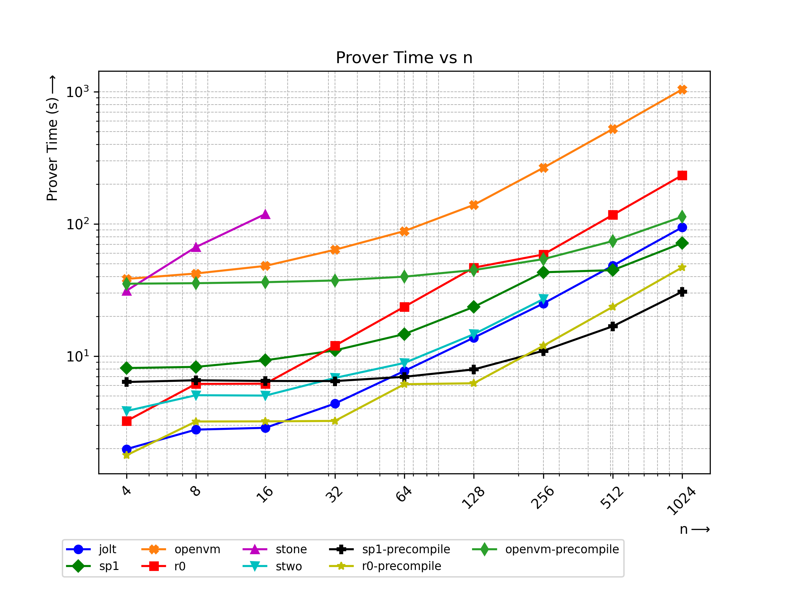

### Verifier Time (ms)
| n                 |   16 | 32   | 64   | 128   | 256   | 512   | 1024   |
|-------------------|------|------|------|-------|-------|-------|--------|
| jolt              |   62 | 63   | 95   | 51    | 75    | 53    | 55     |
| sp1               |  188 | 187  | 193  | 211   | 222   | 449   | 585    |
| openvm            |   65 | 65   | 65   | 65    | 66    | 67    | 69     |
| r0                |   20 | 20   | 20   | 20    | 34    | 53    | 91     |
| stone             |  498 | *    | *    | *     | *     | *     | *      |
| stwo              |   21 | 20.0 | 19.0 | 20.0  | 19.0  | *     | *      |
| sp1-precompile    |  528 | 524  | 528  | 526   | 525   | 524   | 528    |
| r0-precompile     |   20 | 19   | 20   | 15    | 20    | 21    | 20     |
| openvm-precompile |   82 | 82   | 82   | 82    | 82    | 82    | 81     |

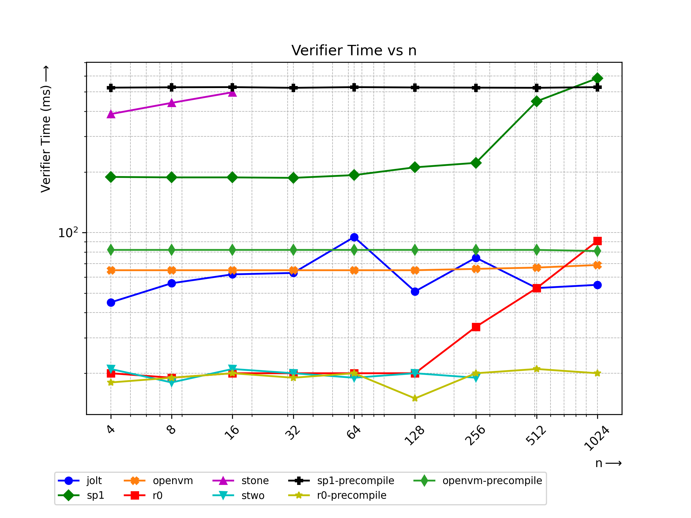

### Proof Size (KB)
| n                 |       16 | 32       | 64       | 128      | 256      | 512      | 1024     |
|-------------------|----------|----------|----------|----------|----------|----------|----------|
| jolt              |  179.923 | 189.691  | 199.875  | 210.476  | 221.492  | 232.924  | 244.772  |
| sp1               | 1799.82  | 1799.816 | 1799.816 | 1875.848 | 1955.08  | 4735.954 | 6539.657 |
| openvm            |  811.409 | 811.409  | 811.409  | 811.409  | 844.705  | 879.345  | 915.329  |
| r0                |  244.442 | 256.154  | 268.378  | 281.626  | 537.404  | 830.878  | 1406.626 |
| stone             |  130.536 | *        | *        | *        | *        | *        | *        |
| stwo              | 1034.96  | 1051.012 | 1071.596 | 1108.644 | 1169.056 | *        | *        |
| sp1-precompile    | 5674.59  | 5674.593 | 5674.593 | 5674.593 | 5674.593 | 5674.593 | 5750.625 |
| r0-precompile     |  221.402 | 221.402  | 244.442  | 244.442  | 256.154  | 268.378  | 281.626  |
| openvm-precompile |  911.697 | 911.697  | 911.697  | 911.697  | 911.697  | 911.697  | 911.697  |

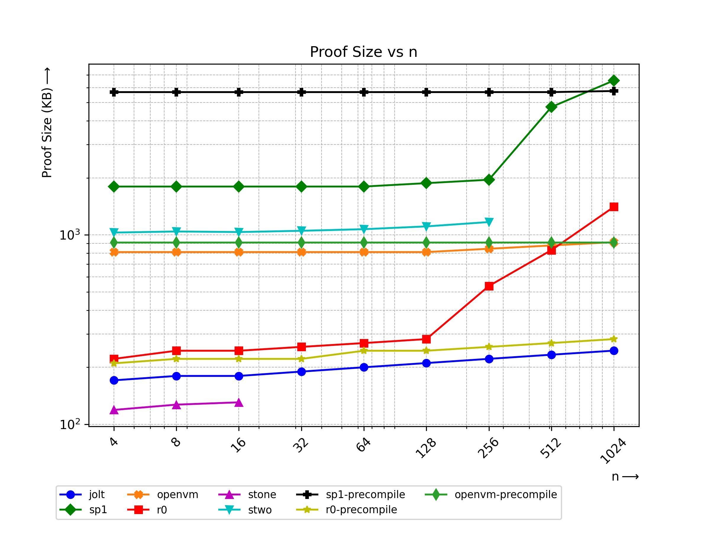

### Cycle Count
| n              |     16 | 32      | 64      | 128     | 256     | 512     | 1024    |
|----------------|--------|---------|---------|---------|---------|---------|---------|
| jolt           | 130697 | 259113  | 515945  | 1029626 | 2056954 | 4111610 | 8220922 |
| sp1            |  83672 | 156424  | 301928  | 592936  | 1174952 | 2338984 | 4667048 |
| r0             |  80858 | 153114  | 297626  | 586650  | 1164698 | 2320794 | 4632986 |
| stone          | 195914 | *       | *       | *       | *       | *       | *       |
| stwo           | 524287 | 1048575 | 2097151 | 4194303 | 8388607 | *       | *       |
| sp1-precompile |  21248 | 35248   | 63248   | 119248  | 231248  | 455248  | 903248  |
| r0-precompile  |  20954 | 33306   | 58010   | 107418  | 206234  | 403866  | 799130  |

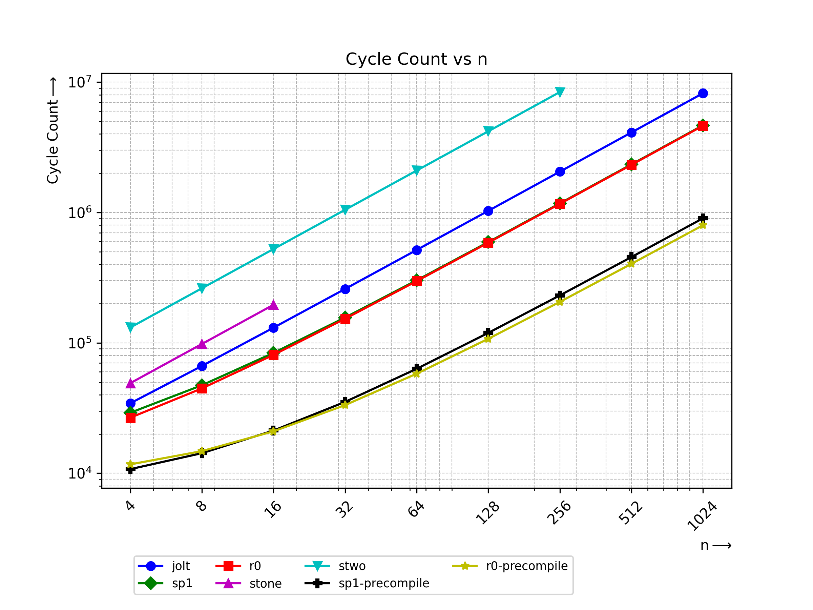

### Peak Memory (GB)
| n                 |     16 | 32   | 64   | 128   | 256   | 512   | 1024   |
|-------------------|--------|------|------|-------|-------|-------|--------|
| jolt              |   4.17 | 6.16 | 9.68 | 16.38 | 30.55 | 59.48 | 117.15 |
| sp1               |   4.86 | 5.45 | 6.51 | 8.93  | 14.27 | 16.0  | 25.53  |
| openvm            |   1.34 | 1.52 | 1.84 | 2.5   | 4.49  | 8.5   | 16.54  |
| r0                |   1.15 | 2.3  | 4.58 | 9.14  | 9.17  | 9.17  | 9.17   |
| stone             | 142.61 | *    | *    | *     | *     | *     | *      |
| stwo              |   3.11 | 3.95 | 5.65 | 10.41 | 19.93 | *     | *      |
| sp1-precompile    |   4.4  | 4.48 | 4.57 | 5.01  | 6.29  | 8.96  | 11.15  |
| r0-precompile     |   0.58 | 0.58 | 1.15 | 1.16  | 2.3   | 4.59  | 9.16   |
| openvm-precompile |   1.19 | 1.2  | 1.22 | 1.27  | 1.36  | 1.55  | 1.92   |

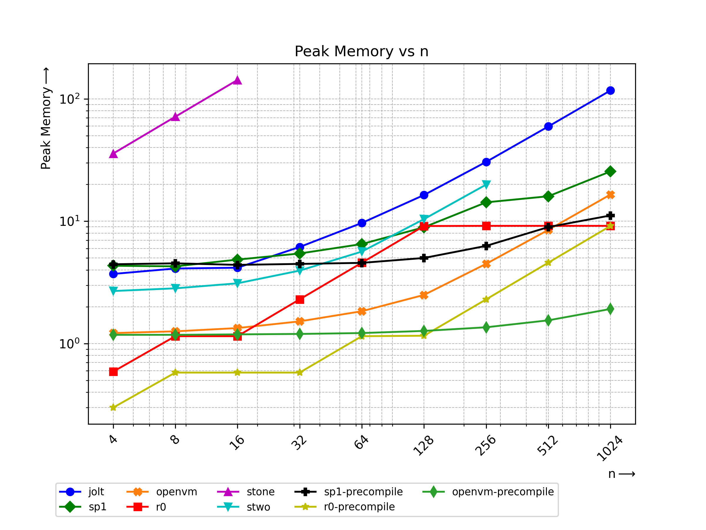


## Sha3
Benchmark Keccak256 hash of `n` bytes. For Stone, the implementation of Keccak256 from stdlib as well as builtin was benchmarked.

### Prover Time (s)
| n                 |    256 |    512 |   1024 |    2048 | 4096    |
|-------------------|--------|--------|--------|---------|---------|
| jolt              |  2.073 |  2.881 |  4.441 |   6.78  | *       |
| sp1               |  8.104 |  9.103 | 11.218 |  14.608 | 23.617  |
| openvm            | 41.95  | 48.2   | 63.093 |  87.555 | 109.404 |
| r0                |  6.162 | 12.02  | 11.912 |  23.512 | 46.882  |
| stone             | 19.587 | 31.812 | 67.232 | 118.284 | *       |
| stwo              |  3.756 |  4.376 |  4.165 |   4.691 | 5.97    |
| sp1-precompile    |  5.825 |  5.842 |  5.883 |   6.099 | 6.541   |
| r0-precompile     | 23.35  | 26.242 | 31.975 |  32.146 | 43.975  |
| openvm-precompile | 36.183 | 36.945 | 38.927 |  42.457 | 50.63   |

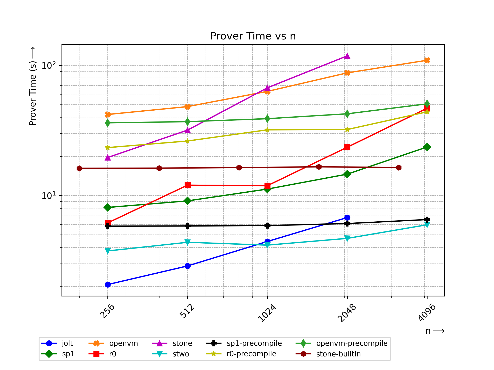

### Verifier Time (ms)
| n                 |   256 |   512 |   1024 |   2048 | 4096   |
|-------------------|-------|-------|--------|--------|--------|
| jolt              |    52 |    70 |     55 |    163 | *      |
| sp1               |   188 |   188 |    187 |    186 | 190    |
| openvm            |    68 |    68 |     69 |     69 | 69     |
| r0                |    20 |    16 |     19 |     20 | 20     |
| stone             |   497 |   491 |    488 |    533 | *      |
| stwo              |    20 |    21 |     20 |     21 | 21     |
| sp1-precompile    |   697 |   699 |    702 |    700 | 709    |
| r0-precompile     |    28 |    29 |     30 |     30 | 31     |
| openvm-precompile |   192 |   193 |    192 |    192 | 192    |

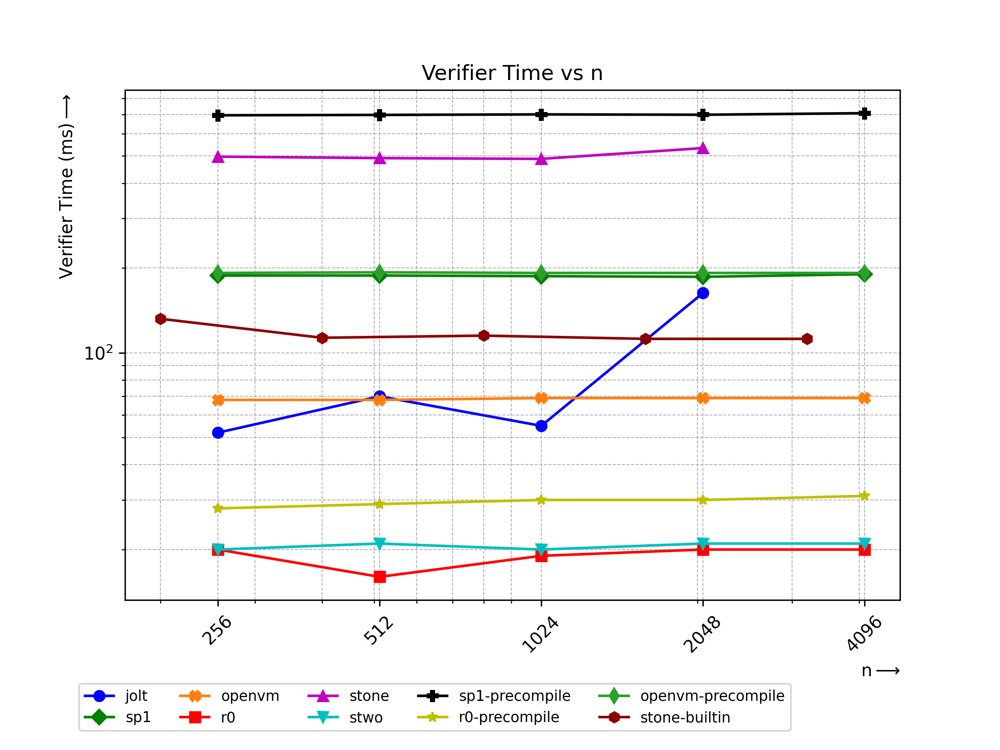

### Proof Size (KB)
| n                 |      256 |      512 |     1024 |     2048 | 4096     |
|-------------------|----------|----------|----------|----------|----------|
| jolt              |  170.796 |  180.404 |  190.684 |  201.892 | *        |
| sp1               | 1799.82  | 1799.82  | 1799.82  | 1799.82  | 1875.848 |
| openvm            |  832.297 |  832.297 |  832.297 |  832.297 | 832.297  |
| r0                |  244.442 |  256.154 |  256.154 |  268.378 | 281.626  |
| stone             |  116.2   |  119.272 |  126.056 |  132.84  | *        |
| stwo              |  970.1   |  989.984 |  978.42  | 1005.32  | 1002.416 |
| sp1-precompile    | 5785.69  | 5785.69  | 5785.69  | 5785.69  | 5785.693 |
| r0-precompile     |  444.535 |  467.575 |  479.287 |  479.287 | 491.511  |
| openvm-precompile | 1556.5   | 1556.5   | 1556.5   | 1556.5   | 1556.497 |

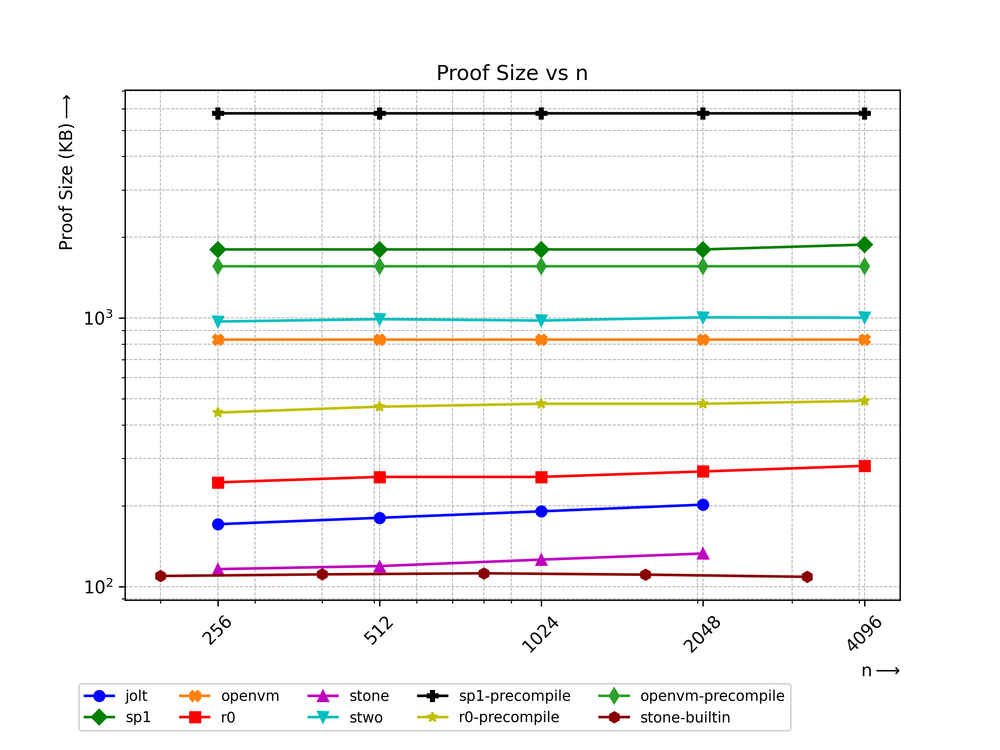

### Cycle Count
| n              |    256 |    512 |   1024 |   2048 | 4096    |
|----------------|--------|--------|--------|--------|---------|
| jolt           |  46269 |  89533 | 176061 | 349248 | *       |
| sp1            |  46003 |  83242 | 157707 | 306632 | 587972  |
| r0             |  63303 | 121245 | 237129 | 468897 | 916134  |
| stone          |  19420 |  38600 |  59047 | 117848 | *       |
| stwo           | 131071 | 131071 | 262143 | 524287 | 1048575 |
| sp1-precompile |  13765 |  18766 |  28755 |  48728 | 88283   |
| r0-precompile  |  36501 |  64021 | 119061 | 229141 | 448213  |

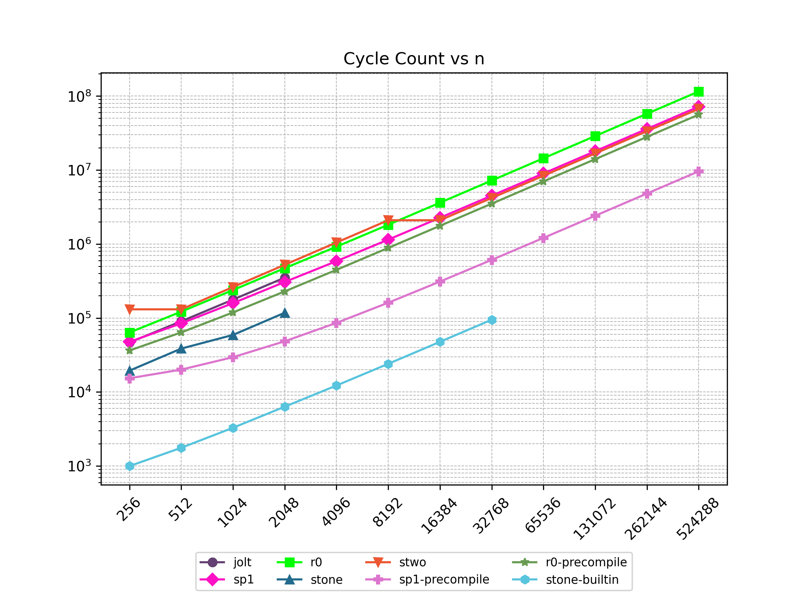

### Peak Memory (GB)
| n                 |   256 |   512 |   1024 |   2048 | 4096   |
|-------------------|-------|-------|--------|--------|--------|
| jolt              |  3.71 |  4.09 |   6.42 |   9.93 | *      |
| sp1               |  4.38 |  4.92 |   5.16 |   6.38 | 8.97   |
| openvm            |  1.26 |  1.34 |   1.52 |   1.84 | 2.16   |
| r0                |  1.15 |  2.3  |   2.3  |   4.59 | 9.17   |
| stone             | 18.96 | 35.75 |  71.43 | 142.49 | *      |
| stwo              |  2.65 |  2.69 |   2.8  |   3.03 | 3.68   |
| sp1-precompile    |  4.05 |  4.04 |   4.16 |   4.43 | 4.43   |
| r0-precompile     |  3.45 |  3.45 |   3.45 |   3.45 | 4.59   |
| openvm-precompile |  1.23 |  1.25 |   1.27 |   1.33 | 1.43   |

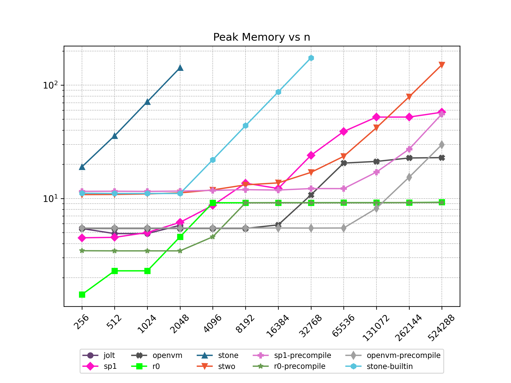

**Stone benchmark with Keccak Builtin**: The function call to the keccak builtin allows max 200 bytes per iteration. So the following benchmarks are hashing multiples of 200 byts.

|    n |   prover time(ms) |   proof size(bytes) |   verifier time(ms) |   cycle count |   peak memory |
|------|-------------------|---------------------|---------------------|---------------|---------------|
|  200 |             16203 |              109544 |                 132 |            46 |         11.12 |
|  400 |             16245 |              111080 |                 113 |            67 |         11.06 |
|  800 |             16388 |              112104 |                 115 |           109 |         11.07 |
| 1600 |             16627 |              110824 |                 112 |           193 |         11.06 |
| 3200 |             16429 |              108776 |                 112 |           361 |         11.07 |


## Sha3-Chain
Benchmark Keccak256 hash of 32 bytes for `n` iteration.

### Prover Time (s)
| n                 |     16 |      32 |      64 |     128 | 256     | 512     | 1024     |
|-------------------|--------|---------|---------|---------|---------|---------|----------|
| jolt              |  7.013 |  13.03  |  23.259 |  44.262 | 93.848  | *       | *        |
| sp1               | 14.501 |  23.756 |  43.207 |  38.246 | 58.892  | 102.763 | 196.466  |
| openvm            | 72.008 | 107.544 | 174.689 | 342.788 | 678.389 | 1335.79 | 2650.006 |
| r0                | 23.534 |  47.231 |  52.974 | 105.221 | 210.543 | 421.088 | 818.903  |
| stwo              |  5.641 |   7.303 |  12.104 |  22.18  | *       | *       | *        |
| sp1-precompile    | 14.661 |  23.38  |  43.066 |  38.243 | 57.568  | 100.493 | 197.563  |
| r0-precompile     | 26.391 |  26.356 |  32.328 |  43.812 | 67.631  | 70.729  | 143.72   |
| openvm-precompile | 38.338 |  41.203 |  47.59  |  59.183 | 83.826  | 133.31  | 231.513  |

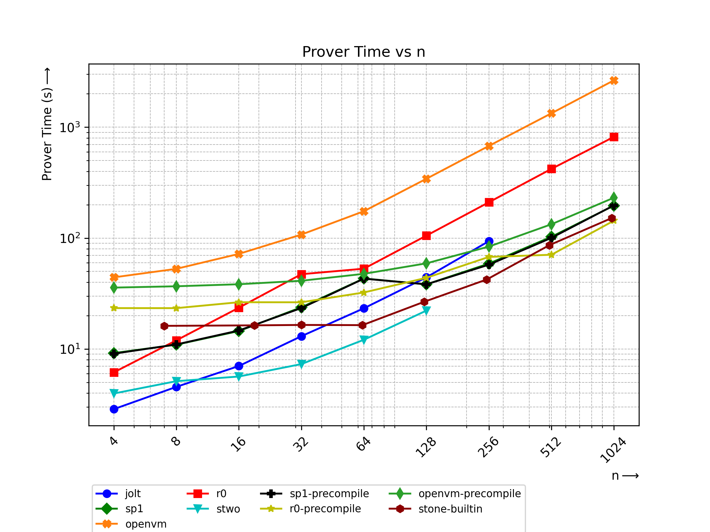

### Verifier Time (ms)
| n                 |   16 |   32 |   64 |   128 | 256   | 512   | 1024   |
|-------------------|------|------|------|-------|-------|-------|--------|
| jolt              |  127 |   63 |   55 |   107 | 71.0  | *     | *      |
| sp1               |  188 |  191 |  213 |   426 | 581   | 894   | 1504   |
| openvm            |   65 |   65 |   65 |    67 | 68    | 69    | 138    |
| r0                |   20 |   20 |   33 |    52 | 90    | 164   | 326    |
| stwo              |   21 |   21 |   19 |    21 | *     | *     | *      |
| sp1-precompile    |  214 |  190 |  220 |   425 | 578   | 885   | 1500   |
| r0-precompile     |   29 |   29 |   30 |    31 | 33    | 47    | 65     |
| openvm-precompile |  189 |  189 |  189 |   189 | 189   | 189   | 189    |

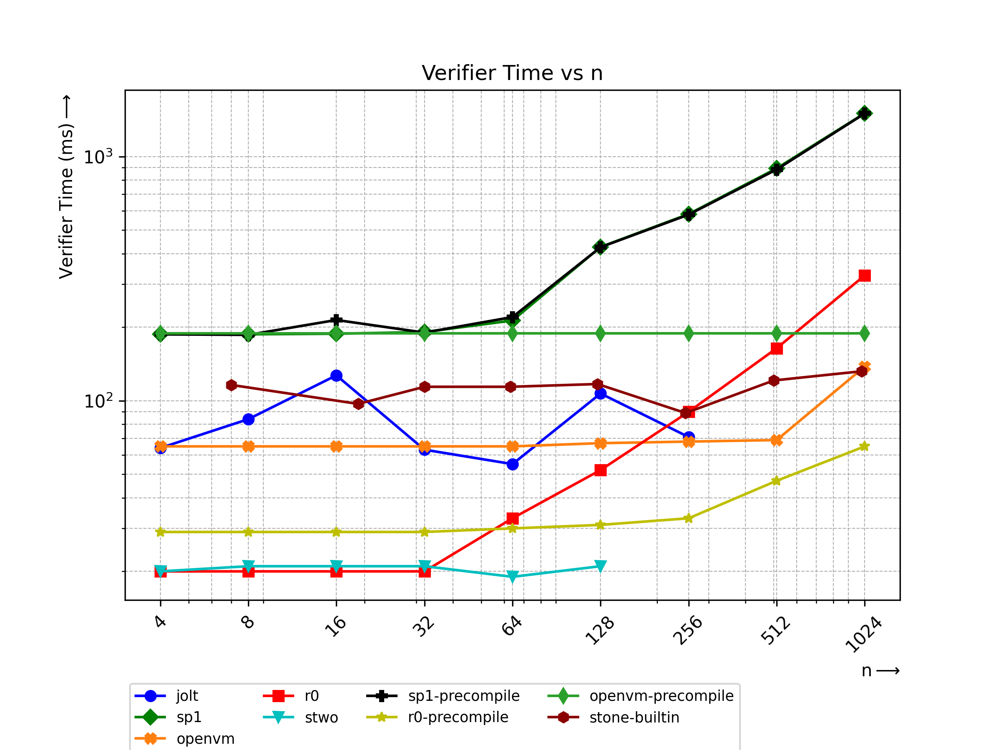

### Proof Size (KB)
| n                 |       16 |       32 |       64 |      128 | 256      | 512      | 1024      |
|-------------------|----------|----------|----------|----------|----------|----------|-----------|
| jolt              |  199.875 |  210.475 |  221.491 |  232.924 | 244.772  | *        | *         |
| sp1               | 1799.82  | 1875.85  | 1955.08  | 4659.92  | 6384.393 | 9833.335 | 16807.251 |
| openvm            |  811.409 |  811.409 |  811.409 |  844.705 | 879.345  | 915.329  | 1813.322  |
| r0                |  268.378 |  281.626 |  525.692 |  818.654 | 1393.378 | 2531.626 | 5049.628  |
| stwo              | 1021.06  | 1044.08  | 1110.28  | 1168.93  | *        | *        | *         |
| sp1-precompile    | 1799.82  | 1875.85  | 1955.08  | 4659.92  | 6384.393 | 9833.335 | 16807.251 |
| r0-precompile     |  467.575 |  467.575 |  479.287 |  491.511 | 504.759  | 725.785  | 1007.035  |
| openvm-precompile | 1538.61  | 1538.61  | 1538.61  | 1538.61  | 1538.609 | 1538.609 | 1538.609  |

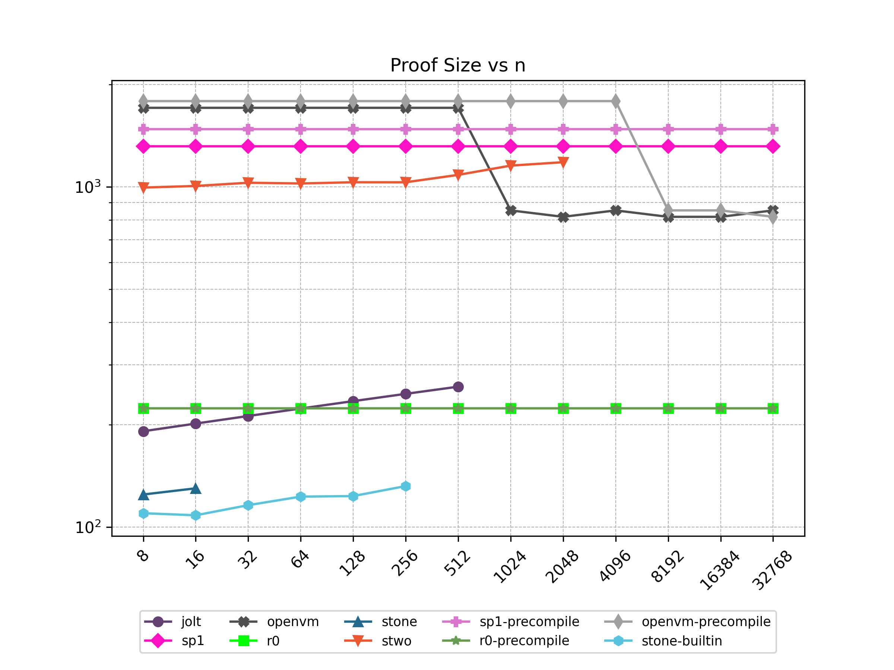

### Cycle Count
| n              |      16 |      32 |      64 |     128 | 256     | 512     | 1024     |
|----------------|---------|---------|---------|---------|---------|---------|----------|
| jolt           |  401064 |  799848 | 1597416 | 3192569 | 6382841 | *       | *        |
| sp1            |  281235 |  552067 | 1093731 | 2177059 | 4343715 | 8677027 | 17343651 |
| r0             |  283329 |  558225 | 1108017 | 2207601 | 4406769 | 8805105 | 17601777 |
| stwo           | 1048575 | 2097151 | 4194303 | 8388607 | *       | *       | *        |
| sp1-precompile |  281235 |  552067 | 1093731 | 2177059 | 4343715 | 8677027 | 17343651 |
| r0-precompile  |   43573 |   75093 |  138133 |  264213 | 516373  | 1020693 | 2034194  |

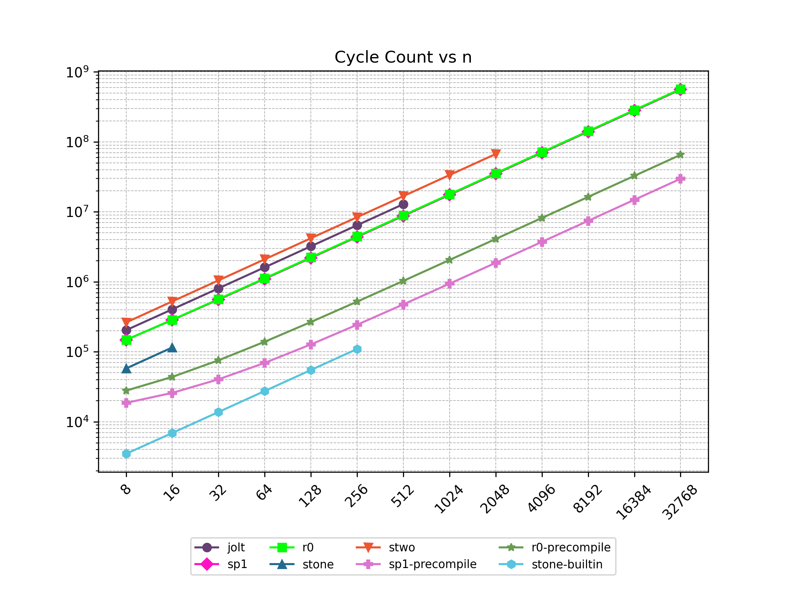

### Peak Memory (GB)
| n                 |   16 |    32 |    64 |   128 | 256    | 512   | 1024   |
|-------------------|------|-------|-------|-------|--------|-------|--------|
| jolt              | 9.81 | 16.77 | 30.52 | 57.9  | 114.25 | *     | *      |
| sp1               | 6.54 |  8.87 | 14.51 | 12.51 | 23.56  | 37.16 | 41.55  |
| openvm            | 1.65 |  2.12 |  3.04 |  5.59 | 10.71  | 20.85 | 20.88  |
| r0                | 4.58 |  9.14 |  9.17 |  9.18 | 9.18   | 9.19  | 9.19   |
| stwo              | 3.61 |  4.95 |  8.98 | 17.06 | *      | *     | *      |
| sp1-precompile    | 6.56 |  8.98 | 14.49 | 12.51 | 23.59  | 37.61 | 40.96  |
| r0-precompile     | 3.45 |  3.45 |  3.45 |  4.57 | 9.13   | 9.16  | 9.16   |
| openvm-precompile | 1.27 |  1.31 |  1.4  |  1.56 | 1.9    | 2.58  | 3.95   |

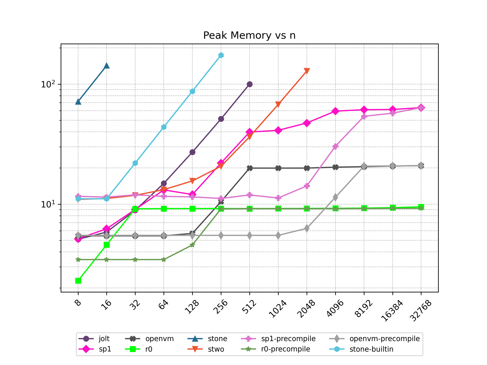

**Stone benchmark with Keccak Builtin**: The function call to the keccak builtin allows max 200 bytes per iteration. So the following benchmarks can be interpreted as hashing `200 * n` bytes data, such as `200 * 37 = 7400` and so on.

|   n |   prover time(ms) |   proof size(bytes) |   verifier time(ms) |   cycle count |   peak memory |
|-----|-------------------|---------------------|---------------------|---------------|---------------|
|   1 |             16156 |              109544 |                 116 |            46 |         11.06 |
|   3 |             16324 |              110312 |                  97 |            88 |         11.07 |
|   5 |             16463 |              109544 |                 114 |           130 |         11.06 |
|  10 |             16401 |              110824 |                 114 |           235 |         11.07 |
|  20 |             26653 |              115944 |                 117 |           445 |         21.96 |
|  40 |             42329 |              117992 |                  89 |           865 |         43.92 |
|  80 |             86267 |              127240 |                 121 |          1705 |         87.22 |
| 160 |            151785 |              135752 |                 132 |          3385 |        174.22 |

## Matrix Multiplication
Benchmark multiplication of two matrices of size n x n.

### Prover Time (s)
| n      |     10 |      20 | 40      | 60      |
|--------|--------|---------|---------|---------|
| sp1    |  8.218 |  15.077 | 46.79   | 135.186 |
| openvm | 39.466 |  73.408 | 347.637 | 1304.04 |
| r0     |  3.181 |  23.522 | 105.533 | 350.857 |
| stone  | 32.563 | 122.947 | *       | *       |
| stwo   |  8.816 |  10.284 | 16.029  | 42.856  |

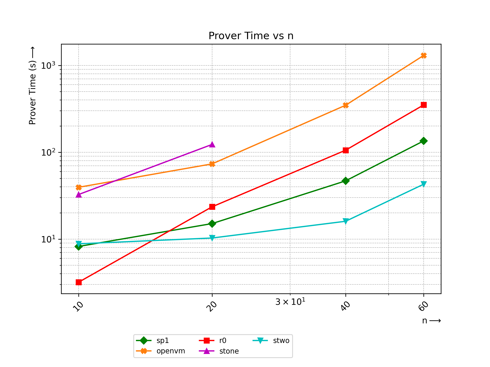

### Verifier Time (ms)
| n      |   10 |   20 | 40   | 60   |
|--------|------|------|------|------|
| sp1    |  188 |  186 | 432  | 912  |
| openvm |   68 |   68 | 69   | 72   |
| r0     |   20 |   20 | 52   | 144  |
| stone  |  399 |  496 | *    | *    |
| stwo   |   81 |   80 | 89   | 83   |

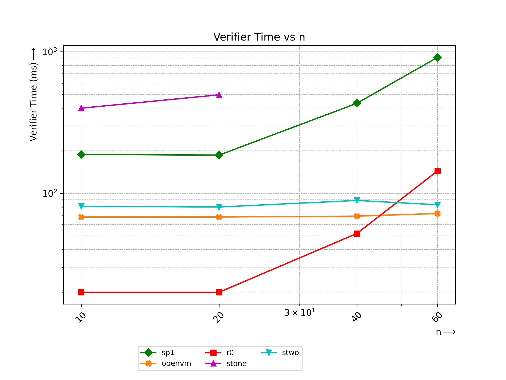

### Proof Size (KB)
| n      |       10 |       20 | 40       | 60       |
|--------|----------|----------|----------|----------|
| sp1    | 1799.79  | 1799.79  | 4735.926 | 9988.571 |
| openvm |  829.609 |  829.609 | 862.905  | 933.529  |
| r0     |  221.154 |  268.13  | 818.406  | 2236.88  |
| stone  |  118.248 |  131.976 | *        | *        |
| stwo   |  841.168 |  848.072 | 851.776  | 948.508  |

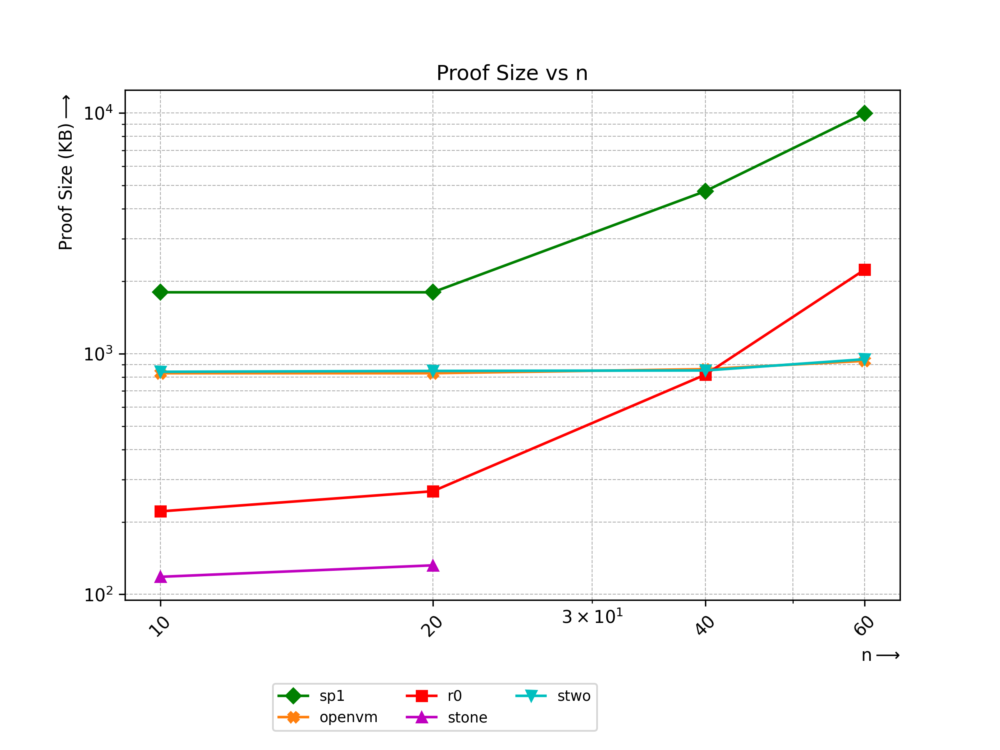

### Cycle Count
| n     |     10 |     20 | 40      | 60       |
|-------|--------|--------|---------|----------|
| sp1   |  43152 | 288755 | 2218768 | 7427170  |
| r0    |  40719 | 286369 | 2216469 | 7424969  |
| stone |  69239 | 492739 | *       | *        |
| stwo  | 131071 | 524287 | 4194303 | 16777215 |

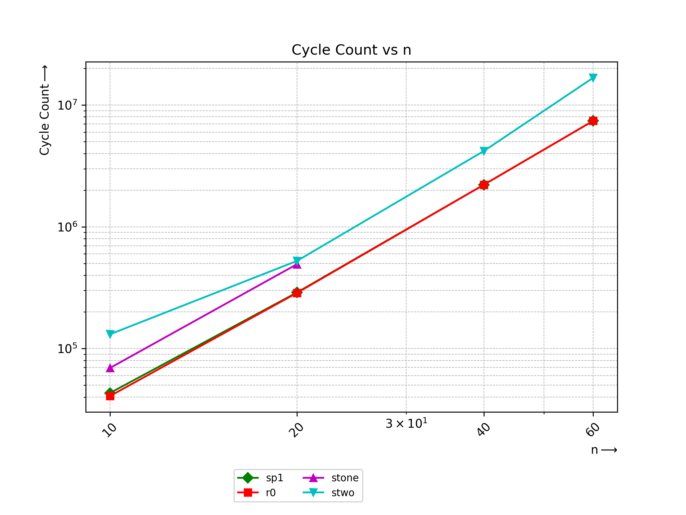

### Peak Memory (GB)
| n      |    10 |     20 | 40    | 60    |
|--------|-------|--------|-------|-------|
| sp1    |  4.4  |   6.61 | 16.52 | 46.65 |
| openvm |  1.23 |   1.66 | 5.71  | 20.56 |
| r0     |  0.58 |   4.58 | 9.17  | 9.18  |
| stone  | 30.13 | 142.91 | *     | *     |
| stwo   |  2.65 |   3.02 | 6.76  | 25.55 |

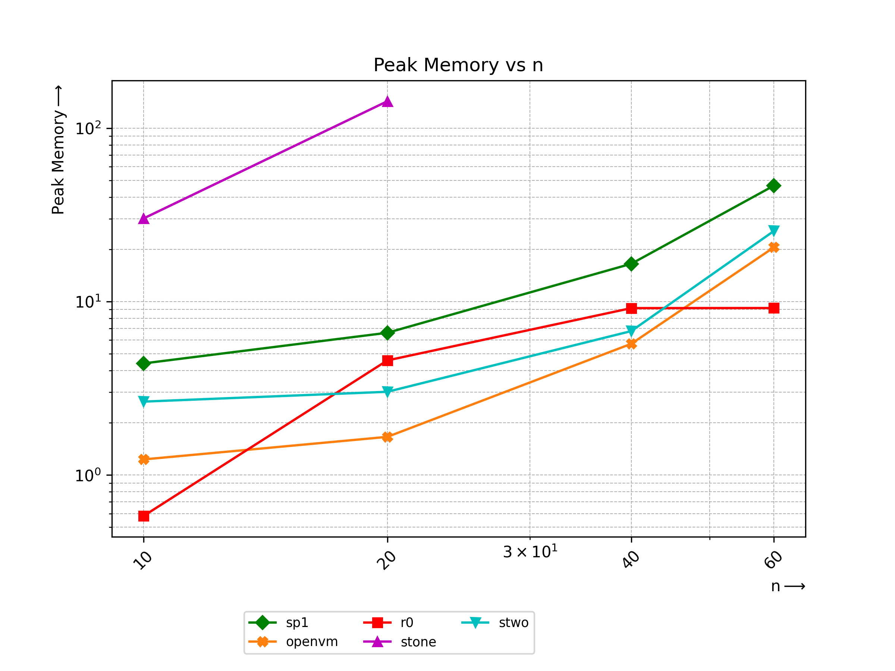