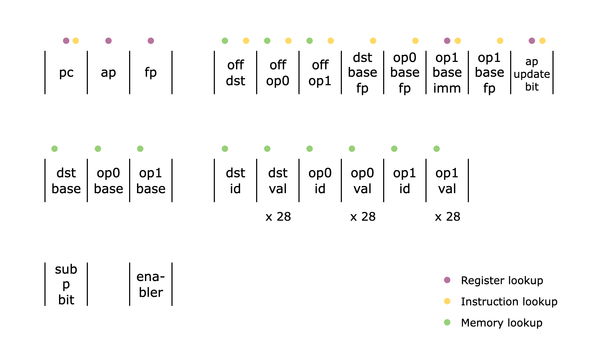

# ADD Opcode Walkthrough

To better understand how `Opcode` componenents work, let's walk through the implementation of the `AddOpcode` component.

<figure id="fig-add-opcode-columns" style="text-align: center;">
    
    <figcaption><center><span style="font-size: 0.9em">Figure 1: The `AddOpcode` columns</span></center></figcaption>
</figure>

Above is the list of all the columns that are used in the `AddOpcode` component. Note that `dst_val`, `op0_val`, and `op1_val` columns are actually 28 columns to support 28 9-bit limbs but we show them as single columns for brevity.

To reiterate what an `Opcode` component does from the [Main Components](../main-components/index.md#opcode-component) section, it verifies the following:

1. the offsets and flag values are correct using the `VerifyInstruction` component.
2. the instruction is correctly mapped to the current `Opcode` component using the flags.
3. the operand values `op0`, `op1`, and `dst` computed with the registers and the offsets are correct using the `Memory` component.
4. the operation for the current `Opcode` component is done correctly.
5. the state transition of the 3 registers (`pc`, `ap`, `fp`) is done correctly using the flags.

```admonish exercise
An instruction should contain 15 bits of flags but only 5 bits are represented in the `AddOpcode` columns. Can you see why?
```

```admonish hint
Check out how a Cairo instruction is pattern-matched to an `ADD` opcode [here](https://github.com/starkware-libs/stwo-cairo/blob/04f142e0376e2a0e797cdb64973449aa3e58a18f/stwo_cairo_prover/crates/adapter/src/opcodes.rs#L349).
```

```admonish hint
Check out how the decomposition of the flags is verified [here](https://github.com/starkware-libs/stwo-cairo/blob/04f142e0376e2a0e797cdb64973449aa3e58a18f/stwo_cairo_prover/crates/cairo-air/src/components/subroutines/decode_instruction_bc3cd.rs#L59).
```

Numbers 1 and 3 should be familiar as we already covered them in the [Main Components](../main-components/index.md#opcode-component) section. As for number 2, you can check the specs for the `ADD` opcode [here](https://github.com/starkware-libs/stwo-cairo/blob/04f142e0376e2a0e797cdb64973449aa3e58a18f/stwo_cairo_prover/crates/adapter/src/opcodes.rs#L349) and for number 5, the specs for a valid state transition can be found in Section 4.5 of the [Cairo paper](https://eprint.iacr.org/2021/1063.pdf).

In this section, we will focus on how number 4 is implemented.

## Adding Two 252-Bit Integers

Assuming that the operands `op0`, `op1`, and `dst` are correctly accessed from the `Memory` table, we now check that the addition of two 252-bit integers is done correctly, i.e. `op0 + op1 = dst`. As noted in the [Felt252 to M31](../basic-building-blocks/index.md#felt252-to-m31) section, a 252-bit integer is stored as 28 9-bit limbs, so we need to check addition for each of the 28 limbs.

We will incrementally build up to the final constraint.

### Limb-wise Addition and Carry

To verify that the two sets of limbs are correctly added, we need to check limb-wise addition. Since each limb can create a carry, however, we also need to add the carry from the previous limb, except for the first limb. Thus, the constraint will look something like this:

```
carry_limb_1 = (op0[0] + op1[0] - dst[0]) / 2^9
carry_limb_1 * (carry_limb_1 - 1) = 0

carry_limb_2 = (op0[1] + op1[1] + carry_limb_1 - dst[1]) / 2^9
carry_limb_2 * (carry_limb_2 - 1) = 0

...

op0[27] + op1[27] + carry_limb_27 - dst[27] = 0
```

We divide `op0[0] + op1[0] - dst[0]` by `2^9` since `op0[0] + op1[0] - dst[0]` should either be `2^9` (if carry exists) or `0` (if carry doesn't exist) and dividing it by `2^9` will result in `1` or `0`, respectively. Then, to check that the carry is either `0` or `1`, we create the constraint `carry_limb_0 * (carry_limb_0 - 1) = 0`. For the final limb, we simply check that the addition is correct.

### Handling Overflowing the 252-bit Prime Field

In addition, we also need to take into account the addition overflowing the 252-bit prime field `P` (i.e. `op0 + op1 = dst + P`). To check this, we introduce a witness variable `sub_p_bit`, which is a 1-bit value that can be set to 1 if there is indeed an overflow. Note that since `P = 2^251 + 17 * 2^192 + 1`, we only need to subtract in the 3 limbs where `P` has a non-zero limb: `0`, `22`, `27`.

Now let's revisit the constraints:

```
sub_p_bit * (sub_p_bit - 1) = 0

carry_limb_1 = (op0[0] + op1[0] - dst[0] - sub_p_bit) / 2^9
carry_limb_1 * (carry_limb_1 - 1) = 0

...

carry_limb_23 = (op0[22] + op1[22] + carry_limb_22 - dst[22] - sub_p_bit * 136) / 2^9
carry_limb_23 * (carry_limb_23 - 1) = 0

...

op0[27] + op1[27] + carry_limb_27 - dst[27] - sub_p_bit * 256 = 0
```

First, we verify that `sub_p_bit` is indeed a bit. Then, we subtract `sub_p_bit` from the first limb, `sub_p_bit * 136` from the 22nd limb, and `sub_p_bit * 256` from the 27th limb. (Note that `136` and `256` are the values of `P` in the 22nd and 27th limbs, respectively.)

A caveat of this approach is that subtracting by `sub_p_bit` can introduce an underflow, i.e. `(op0[0] + op1[0] - dst[0] - sub_p_bit) / 2^9 = -1`. This means that `carry_limb_0` can also be `-1` and not just `0` or `1`. Thus, we need to update the constraint for all carries to the following:

```
...

carry_limb_1 * (carry_limb_1 - 1) * (carry_limb_1 + 1) = 0

...
```

### Optimization

If we want to optimize the number of constraints, we can combine all the constraints for computing the sum into a single constraint. Naively checking that `carry_limb_1 = (op0[0] + op1[0] - dst[0] - sub_p_bit) / 2^9` means that we allocate a column for `carry_limb_1`. However, we can keep `carry_limb_1` as an intermediate value and include the equation when computing the next carry. For example, the second limb carry will be computed as follows:

```
carry_limb_2 = (op0[1] + op1[1] + ((op0[0] + op1[0] - dst[0] - sub_p_bit) / 2^9) - dst[1]) / 2^9
```

This way, we do not have to allocate any extra columns for the carries, and we can go on until the last limb, where we check that the giant equation is correct.

This is possible because the computation does not involve any multiplication of witness values, so the constraint does not blow up in degree.

### Final Constraint

One last thing to note is that in the implementation, we change the division by `2^9` to a multiplication by `2^22`, which is equivalent in the M31 field since `2^9` and `2^22` are multiplicative inverses of each other, i.e. `2^9 * 2^22 = 1 mod 2^31-1`.

So the final constraint will look like this:

```
sub_p_bit * (sub_p_bit - 1) = 0

carry_limb_1 = (op0[0] + op1[0] - dst[0] - sub_p_bit) * 2^22 // intermediate representation
carry_limb_1 * (carry_limb_1 - 1) * (carry_limb_1 + 1) = 0

...

carry_limb_27 = (op0[26] + op1[26] + carry_limb_26 - dst[26]) * 2^22 // intermediate representation
carry_limb_27 * (carry_limb_27 - 1) * (carry_limb_27 + 1) = 0

op0[27] + op1[27] + carry_limb_27 - dst[27] - sub_p_bit * 256 = 0
```

## Enabler Column

Finally, we need to introduce the last column in the `AddOpcode` component, the `enabler` column. As the name suggests, this column is used to either enable or disable the constraint for the current row. It is used for dummy rows that are added to the end of the table to make the number of rows the nearest power of 2. In other words, it is set to `1` for all valid `ADD` opcode calls and `0` for all the dummy rows.
