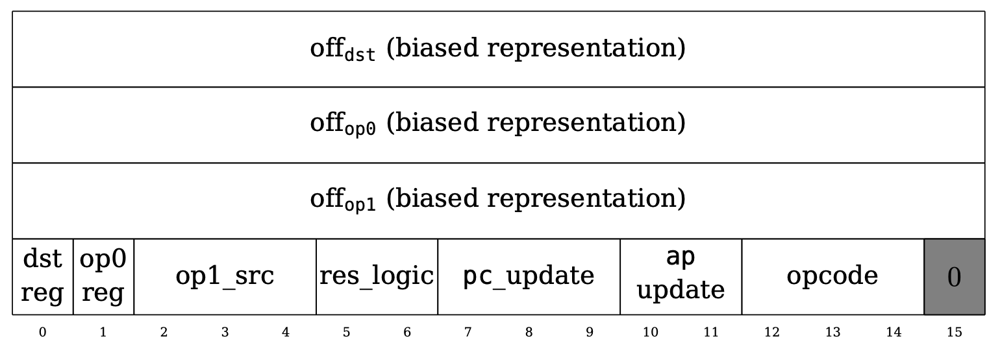

# Cairo

```admonish
This is an informal overview of Cairo. For a more formal explanation, please refer to the original [Cairo paper](https://eprint.iacr.org/2021/1063.pdf).
```

Let's start by understanding how Cairo works. Essentially, Cairo is a CPU architecture that is Turing-complete and is specifically designed so that it can also be used to create efficient proofs of execution using STARKs. In particular, Cairo uses the read-only memory model instead of the more common read-write memory model and does not use any general-purpose registers.

## Non-Deterministic Read-Only Memory

A read-only memory model is a memory model where each address in the memory can only have a single value throughout the execution of the program. This is in contrast to the more common read-write memory model where an address can have multiple values at different points during the execution of the program.

The memory is also non-deterministic, which means that the prover provides the values of the memory cells as witness values and they do not need to be constrained other than that each address can only have a single value throughout the execution of the program.

## Registers

In physical CPUs, accessing the memory is expensive compared to accessing registers due to physical proximity. This is why instructions typically operate over registers rather than directly over the memory cells. Since accessing the memory and accessing registers is the same in Cairo, however, Cairo instructions operate directly over memory cells. Thus, the 3 registers used in Cairo are not used to store instructions or operand values like physical CPUs, but rather pointers to the memory cells where the instructions and operands are stored:

- `pc` is the **program counter**, which points to the current Cairo instruction
- `ap` is the **allocation pointer**, which points to the current available memory address
- `fp` is the **frame pointer**, which points to the current frame in the "call stack"

## Cairo Instructions

Let's now see what a Cairo instruction looks like.

<figure id="fig-cairo-instruction" style="text-align: center;">
    
    <figcaption><center><span style="font-size: 0.9em">Figure 1: Cairo instruction (little-endian)</span></center></figcaption>
</figure>

As the figure above from the [Cairo paper](https://eprint.iacr.org/2021/1063.pdf) shows, an instruction is made up of 64 bits, where the first 3 16-bit integers are signed offsets to the 3 operands `dst`, `op0`, and `op1`.

The next 15 bits are flags, where the `dst_reg` and `op0_reg` 1-bit flags indicate whether to use the `ap` or the `fp` register value as the base value for the `dst` and the `op0` operands. The `op1_src` flag supports a wider range of base values for the `op1` operand: `op0`, `pc`, `fp`, and `ap`. The `res_logic` flag indicates how to compute the `res` operand: `op1`, `op0 + op1`, or `op0 * op1`. The `pc_update` and `ap_update` flags show how to update the `pc` and `ap` registers after computing the operands and the `opcode` flag indicates whether this instruction belongs to a predefined opcode (e.g. `CALL`, `RET`, `ASSERT_EQ`) or not and also defines how the `ap` and `fp` registers should be updated.

```admonish
For a more detailed explanation of the flags, please refer to Section 4.5 of the [Cairo paper](https://eprint.iacr.org/2021/1063.pdf).
```

Finally the last bit is fixed to 0, but as we will see in the next section, this design is modified in the current version of Cairo to support opcode extensions.

### Opcodes and Opcode Extensions

In Cairo, an **opcode** refers to what the instruction should do. Cairo defines a set of common CPU operations as specific opcodes (e.g. `ADD`, `MUL`, `JUMP`, `CALL`), but for Stwo, it also defines a new set of opcodes that are used to improve the performance of heavy computation such as Blake2s hash and QM31 addition and multiplication.

Since the current 64-bit instruction structure is not flexible enough to support this, Cairo now extends the instruction size to 72 bits and uses the last 9 bits as the **opcode extension** value.

<figure id="fig-opcode-extension" style="text-align: center;">
    
    <figcaption><center><span style="font-size: 0.9em">Figure 2: New instruction format with opcode extension</span></center></figcaption>
</figure>

As of [this commit](https://github.com/starkware-libs/stwo-cairo/blob/b712c77887f8f8ce0d39a8a9741221c89846836e/stwo_cairo_prover/crates/adapter/src/decode.rs#L4), the following opcode extension values are supported:

- `0`: Stone (original opcodes)
- `1`: Blake
- `2`: BlakeFinalize
- `3`: QM31Operation

```admonish
Even if the instruction does not belong to any predefined set of opcodes, it will be considered a valid opcode as long as it adheres to the state transition function defined in Section 4.5 of the [Cairo paper](https://eprint.iacr.org/2021/1063.pdf). In Stwo Cairo, this is referred to as a _generic opcode_.
```
