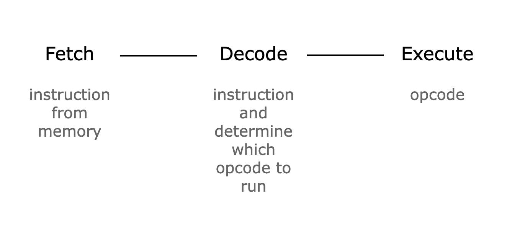

# Main Components

Now that we have a basic understanding of how Cairo works and the basic building blocks that are used to build the Cairo AIR, let's take a look at the main components of the Cairo AIR.

```admonish
For readers who are unfamiliar with the concepts of components and lookups, we suggest going over [this section](../../air-development/components/index.md) of the book.
```

## Fetch, Decode, Execute

Cairo follows the common CPU architecture of fetching, decoding, and executing an instruction in a single CPU step. Thus, to prove the correctness of the execution of a Cairo program, the Cairo AIR can write the results of fetching, decoding, and executing an instruction at every CPU step into a trace and prove that the constraints over the trace are consistent with the semantics of Cairo.

<figure id="fig-cairo-air-fetch-decode-execute" style="text-align: center;">
    
    <figcaption><center><span style="font-size: 0.9em">Figure 1: A single CPU step in Cairo</span></center></figcaption>
</figure>

Let's keep this in mind while we go over the main components of the Cairo AIR.

## Memory Component

The first component we need is a `Memory` component, which implements the non-deterministic read-only memory model of Cairo.

In Cairo AIR, instead of mapping the memory address to a value directly, we first map the `address` to an `id` and then map the `id` to a `value`. This is done to classify the memory values into 2 groups: `Small` and `Big`, where `Small` values are 72-bit integers and `Big` values are 252-bit integers. As many memory values do not exceed the `Small` size, this allows us to save cost on unnecessary padding.

As a result, the `Memory` component is actually 2 components, `MemoryAddressToId` and `MemoryIdToValue`.

The constraint for the `Memory` component is as follows:

1. An `address` must appear once and only once in the `MemoryAddressToId` component
2. Each `address` is mapped to a unique `id`

[TODO: revisit this]

The way the first constraint is implemented is by using a preprocessed column that contains the sequence of numbers `[0, MAX_ADDRESS)` and using this as the address values (in the actual code, memory address starts at 1, so we need to add 1 to the sequence).

The second constraint works in a similar way. An `id` is a 31-bit integer that is incremented by 1 from 0 whenever there is a unique memory access. For example, if the addresses `[5, 1523, 142]` were accessed in that order, the id for those addresses will be `(5, 0)`, `(1523, 1)`, and `(142, 2)`. In case the value of that address is a `Big` value, the MSB of the 31-bit integer is switched to 1. Since the `id` also uses the sequence of values `[0, NUM_SMALL_VALUES_ACCESSED)` and `[2^30, NUM_BIG_VALUES_ACCESSED)`, we can use the preprocessed column as the `id` values.

## VerifyInstruction Component

The `VerifyInstruction` component is responsible for accessing the instruction from the `Memory` component and decomposing the retrieved value. As mentioned in the [Felt252 to M31](../basic-building-blocks/index.md#felt252-to-m31) section, a 252-bit integer is stored as 28 9-bit limbs, so we need to decompose the limbs and concatenate them to get the values we need. For example, in order to get the 3 16-bit offset values, we need to decompose the first 6 limbs into `[9, [7, 2], [9], [5, 4], [9], [3, 6]]` and concatenate them as the following: `[[9, 7], [2, 9, 5], [4, 9, 3]]`. Then, the remaining `6` and the next limb will correspond to the 15-bit flags, and the next (8th) limb will be the opcode extension value. At the end, we will have decomposed the instruction value into 3 16-bit offsets, 2 chunks of flags, and a 9-bit opcode extension.

Note that the decomposition will be constrained by range-checking that each of the integers in their corresponding range.

## Opcode Component

Since every Cairo instruction can be mapped to a specific `Opcode`, we can check that a Cairo instruction is executed by checking that the corresponding `Opcode` component was executed correctly. You can think of the `Opcode` component as the main component that uses the `VerifyInstruction` and `Memory` components.

We define a single `Opcode` component for each predefined opcode and also a `GenericOpcode` component, which will be used for all instructions that do not map to any of the predefined opcodes.

The following is a list of constraints that the `VerifyInstruction` component needs to satisfy:

1. verifies that the offsets and flag values are correct using the `VerifyInstruction` component.
2. verifies that the instruction is correctly mapped to the current `Opcode` component using the flags.
3. verifies that the operand values `op0`, `op1`, and `dst` computed with the registers and the offsets are correct using the `Memory` component.
4. verifies that the operation for the current `Opcode` component is done correctly.
5. verifies that the state transition of the 3 registers (`pc`, `ap`, `fp`) is done correctly using the flags.

Of these constraints, the numbers 2 and 4 are self-contained, as in they do not require any other components to be verified. We will explore how the remaining 3 are verified using lookups between the different components.

## Bringing It All Together

The following figure shows how each component is connected to each other using lookups. If we look at the right-hand side first, we can see that this side shows the main components of the Cairo AIR. The boxes in the components correspond to lookups added to each component and the boxes with the same fill color correspond to lookups to the same values. Lookups that are added to the claimed sum have blue edges and the ones that are subtracted from the claimed sum have red edges. On the left-hand side, we can see lookups that that the prover provides as part of the proof and therefore the verifier can compute the lookup values themselves and add to the total sum. The ultimate goal is to make the sum of all the lookups to equal to zero.

<figure id="fig-cairo-air-main-components" style="text-align: center;">
    
    <figcaption><center><span style="font-size: 0.9em">Figure 2: Lookups between the main components</span></center></figcaption>
</figure>

### Memory Lookups

The memory lookups correspond to looking up the `(address, id)` and `(id, value)` pairs. In the `Memory` component, each of the lookups are multiplied with a witness value `mult`, which indicates the amount of times each memory address was accessed. Since the memory accesses are **added** to the total sum and the same amount is **subtracted** from the total sum in the `Memory` component, the total sum for memory lookups should equal zero.

Note that the verifier also adds the lookups for the Cairo program, which is necessary to ensure that the correct program is actually stored in memory and is properly executed.

### Instruction Lookups

Once the `VerifyInstruction` component retrieves the instruction value using the `(pc_addr, pc_id)` and `(pc_id, pc_val)` lookups, it subtracts the lookup of the tuple `(pc, dst_off, op0_off, op1_off, flags1, flags2, opcode_extension)`, which are the decomposed values of the instruction. The reason this lookup also has a `mult` witness is because the `VerifyInstruction` component has a single row for each unique `pc` value. Thus, if the same `pc` value is invoked multiple times throughout the program, the tuple should be added multiple times to the total sum.

### Register Lookups

🚧
